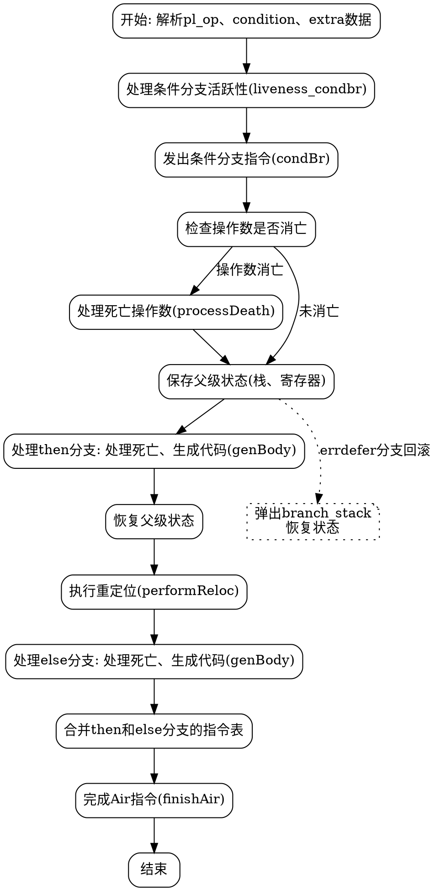

嗯，我需要为提供的Zig函数`airCondBr`绘制一个流程图。首先，我得仔细阅读代码，理解它的结构和逻辑流程。这个函数似乎处理条件分支，生成相应的机器码，处理寄存器和栈的分配，以及处理不同分支中的指令。

首先，函数开始于获取`pl_op`和`condition`，然后解析`extra`数据，得到`then_body`和`else_body`。接着处理条件分支的活跃性信息，然后发出条件分支指令，处理操作数的消亡。

接下来，保存父级的栈和寄存器状态，生成`then`分支的代码，之后恢复父级状态，处理`else`分支。之后合并两个分支的指令表，确保一致，最后完成空气指令。

我需要将这些步骤分解成不同的节点，并根据条件、循环和函数调用创建流程。可能的分支包括条件判断后的两个路径（then和else），以及处理死亡操作数和状态恢复的部分。

需要注意的是，流程图中需要展示条件分支后的两个路径，以及各自的处理步骤，包括生成代码、恢复状态、合并结果等。还要注意错误处理部分，比如`errdefer`块。

可能的结构：

1. 开始：获取pl_op、condition、extra。
2. 处理条件分支的活跃性。
3. 发出条件分支指令。
4. 检查操作数是否消亡，处理死亡。
5. 保存父级状态（栈、寄存器）。
6. 处理then分支：处理死亡，生成代码。
7. 恢复父级状态。
8. 处理else分支：处理死亡，生成代码。
9. 合并两个分支的指令表。
10. 结束，返回结果。

此外，错误处理部分（如errdefer）需要在流程图中体现，但可能需要作为单独的节点或注释。

接下来，将这些步骤转化为Graphviz的节点和边，注意条件判断的分支，以及可能的循环（如处理then和else中的条目）。
================================================

该流程图使用Graphviz语法，主要特点：

1. 使用矩形圆角节点表示操作步骤
2. 实线箭头表示主流程走向
3. 虚线箭头和注释节点表示错误处理路径
4. 条件判断用标签说明分支条件
5. 完整覆盖了函数的关键步骤：
   - 初始解析
   - 活跃性分析
   - 条件分支生成
   - 操作数生命周期管理
   - 状态保存/恢复
   - 双分支代码生成
   - 指令表合并
   - 最终收尾

节点顺序遵循代码执行流程，同时通过样式区分主流程和错误处理机制。