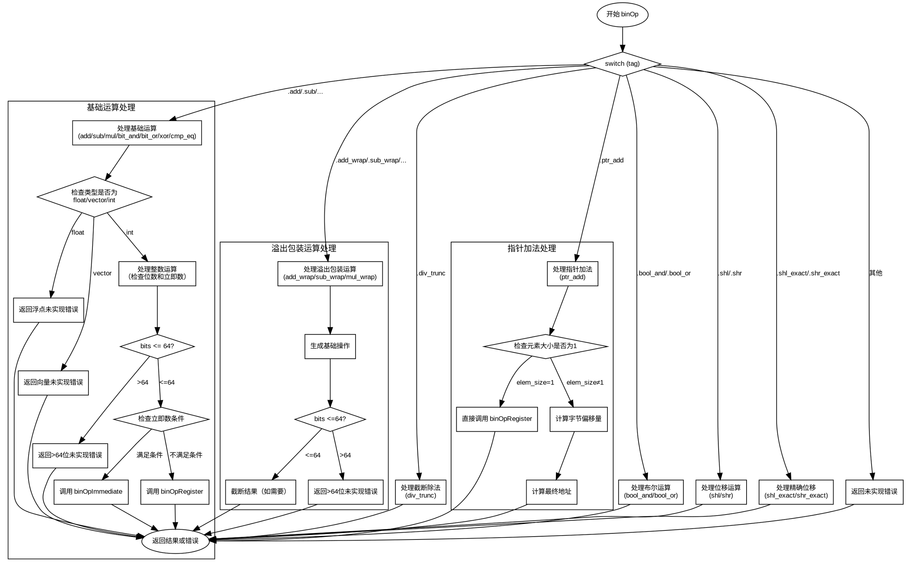

好的，我需要根据提供的Zig代码中的`binOp`函数来生成一个Graphviz的流程图。首先，我需要理解这个函数的结构和逻辑流程。

函数`binOp`处理不同的二进制操作，根据不同的`tag`（操作类型）和类型信息（比如整数、浮点数、向量等）来分发不同的处理逻辑。主要的逻辑分支包括处理基本算术运算（如add、sub、mul等）、溢出包装操作（如add_wrap）、除法、指针加法、布尔逻辑、位移操作等。

首先，我会确定函数的主干流程。函数开始于一个`switch (tag)`语句，根据不同的操作标签进入不同的处理分支。每个分支内部可能还有进一步的类型检查和操作分发，例如检查类型是否为整数、浮点数或向量，以及处理立即数或寄存器操作数的情况。

接下来，我需要将这些逻辑分支转化为流程图中的节点和边。每个主要的`case`分支（如`.add, .sub, ...`）将成为一个决策节点，然后根据类型检查进一步分派到不同的处理路径。例如，在处理整数运算时，会检查位数是否超过64，然后选择立即数或寄存器操作，或者报告未实现的错误。

需要注意，流程图中需要涵盖所有可能的路径，包括错误处理（如`self.fail`调用）和递归调用（如`binOpImmediate`或`binOpRegister`）。此外，每个条件判断（如`switch (lhs_ty.zigTypeTag(zcu))`）都需要在流程图中体现为分支节点。

在处理具体分支时，比如`.ptr_add`，需要展示其子步骤，如计算元素大小、调整偏移量等。对于位移操作（如`.shl_exact`），需要区分有符号和无符号的情况，以及不同位数的处理方式。

最后，确保所有可能的`tag`情况都被覆盖，包括最后的`else`分支处理未实现的操作。

在绘制Graphviz图时，使用节点表示操作或判断，边表示流程方向。使用菱形节点表示条件判断，矩形节点表示处理步骤或函数调用，椭圆形节点表示开始和结束。同时，确保每个分支都有明确的出口，比如返回结果或触发错误。

现在，我需要将上述分析转化为具体的Graphviz代码，确保逻辑清晰，结构正确，没有遗漏任何关键步骤。
================================================
