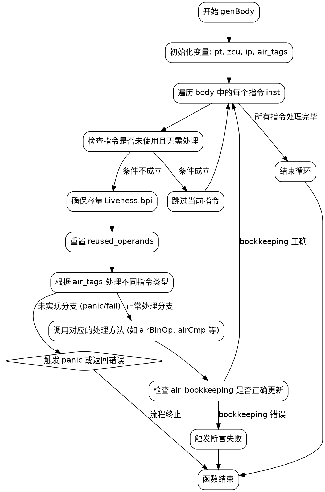

好的，我需要帮助用户生成一个使用Graphviz的流程图，描述他们提供的Zig函数genBody的流程。首先，我需要仔细阅读并理解这个函数的代码结构。

函数genBody接收一个self指针和一个body参数，body是一个指令索引的切片。函数遍历body中的每个指令，根据不同的AIR指令类型调用相应的方法。主要的逻辑在for循环中，处理每个inst，跳过未使用的指令，然后根据air_tags选择对应的处理分支。此外，还有一些错误处理和书keeping的代码。

流程图应该从函数入口开始，依次展示主要步骤：初始化变量，遍历body中的每个指令，检查指令是否被使用，处理不同的指令类型，错误检查，最后结束循环。需要注意条件判断和循环结构的分支。

需要注意的点：
1. 主循环遍历body中的每个inst。
2. 对于每个inst，首先检查是否被使用，如果是则跳过。
3. 处理不同的AIR指令，这里有很多分支，可能不需要每个都详细画出，可以归类或用注释表示。
4. 存在panic和fail的情况，这些可以作为流程中的终止节点或错误处理分支。
5. 最后的书keeping检查，确保正确处理了每个指令。

可能需要将复杂的switch case简化为一个节点，说明根据不同的指令类型进行处理，避免图表过于复杂。同时，错误处理和断言部分也需要体现出来。

接下来，按照Graphviz的语法结构，使用节点和边来表示流程。开始节点、循环、条件判断、处理指令、错误处理、结束节点等都需要正确连接。
================================================
