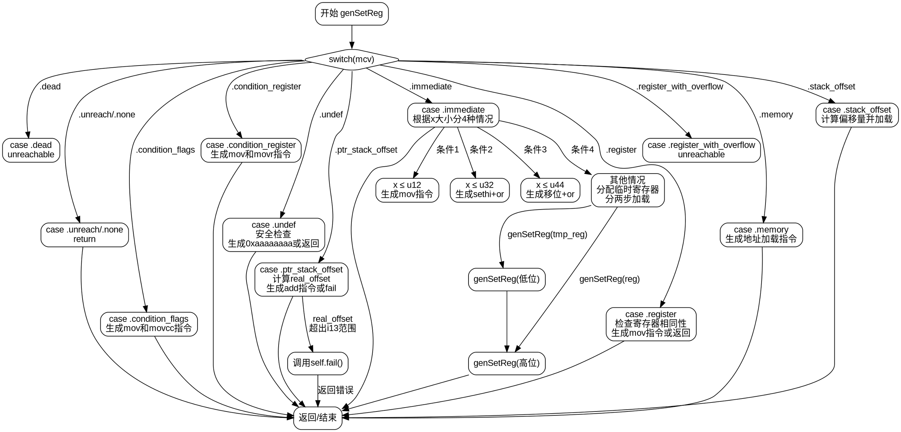

好的，我需要为提供的Zig函数genSetReg绘制流程图。首先，我需要理解这个函数的结构和逻辑分支。函数处理不同的MCValue情况，每个case有不同的处理步骤。

首先，函数开始于检查mcv的不同情况。每个case对应不同的操作，比如.dead、.unreach、.condition_flags、.undef等。每个case内部有相应的指令生成步骤，可能涉及条件判断、循环或子函数调用。

我需要将每个case作为一个决策分支，然后画出每个分支的处理流程。例如，当mcv是.immediate时，根据x的大小分为多个子情况，每个子情况生成不同的指令。对于较大的立即数，可能需要分配临时寄存器，并生成多条指令。

需要注意递归调用的情况，比如在.immediate的最后一个子情况中，调用了genSetReg自身两次，然后进行位移和或操作。此外，还要处理可能的错误返回，比如在.ptr_stack_offset中的real_offset无法转换为i13时，调用self.fail。

另外，对于.register情况，如果源寄存器和目标寄存器相同，直接返回，否则生成mov指令。.memory和.stack_offset情况则涉及加载内存中的数据到寄存器。

在绘制流程图时，应使用graphviz的语法，使用节点和边来表示控制流。每个case作为不同的节点，内部处理步骤作为子节点或流程步骤。需要注意条件判断的分支，比如if语句和可能的错误处理。

需要确保所有分支都被覆盖，包括错误处理和递归调用。同时，保持流程图的清晰和层次结构，避免交叉和混乱的连线。

最后，检查是否有遗漏的情况或步骤，确保流程图准确反映函数的逻辑流程。
================================================
