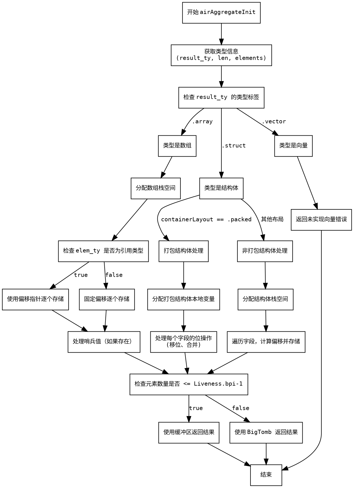

嗯，我需要为这个Zig函数`airAggregateInit`画一个流程图。首先，我得仔细阅读代码，理解它的结构和逻辑流程。这个函数似乎是用来处理聚合类型（如数组、结构体）的初始化。

首先，函数开始部分获取了一些类型信息和元素长度。然后根据结果类型的不同（数组、结构体、向量等）进行不同的处理。对于数组类型，它分配栈空间，处理每个元素，考虑元素是否为引用类型，决定是移动指针还是固定偏移。对于结构体，特别是打包结构体（packed struct），处理方式更复杂，涉及到位操作和字段偏移的计算。如果遇到向量类型，目前还未实现，会返回错误。

接下来，我需要确定每个条件分支和循环的位置。比如，当处理数组时，有`isByRef`的判断，导致两个不同的处理分支。结构体部分又分为打包结构体和非打包结构体两种情况，各自有不同的处理流程。最后，函数根据元素数量决定如何处理结果的返回，可能使用缓冲区或大墓碑（Big Tomb）结构。

在绘制流程图时，应该从函数入口开始，按照条件分支逐步展开。每个条件判断（如类型检查）会分出不同的流程路径。循环部分（如遍历元素）需要用循环节点表示。需要注意的是，处理数组和结构体的内部逻辑较为复杂，尤其是打包结构体的位操作部分，可能需要详细的子流程。

还需要注意错误处理的情况，比如遇到未实现的向量类型时，会触发`cg.fail`。这些错误路径也应该在流程图中体现出来。此外，函数末尾根据元素数量选择不同的返回策略，这也是一个关键的分支点。

总结一下，流程图的结构大致如下：
1. 函数入口，初始化变量。
2. 根据结果类型进入不同的处理分支：
   a. 数组类型：
      i. 分配栈空间。
      ii. 判断元素是否为引用类型，决定存储方式。
      iii. 遍历元素，逐个存储。
   b. 结构体类型：
      i. 打包结构体：
         - 处理位操作，字段的移位和合并。
      ii. 非打包结构体：
         - 处理字段偏移，逐个存储。
   c. 向量类型：返回错误。
3. 处理完成后，根据元素数量选择返回结果的路径。

需要确保每个判断节点正确分叉，循环部分清晰，并且所有可能的路径都被覆盖。特别是那些可能被忽略的边界情况，比如空元素、哨兵值（sentinel）的存在与否，以及结构体中的字段偏移计算。
================================================
