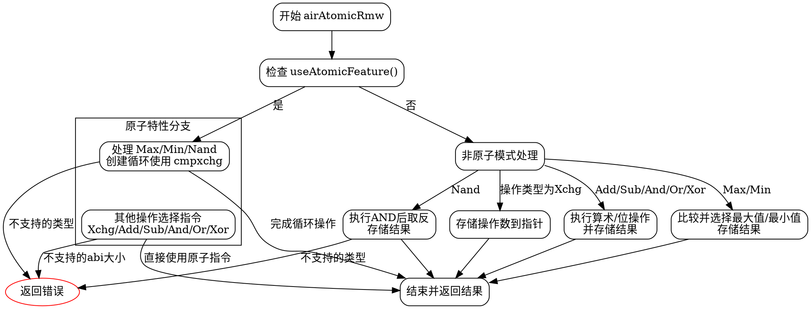

嗯，我需要为这个Zig函数`airAtomicRmw`画一个流程图。首先，我得仔细看看这个函数的结构。函数主要处理原子性的读-修改-写操作，根据不同的操作类型（op）和是否使用原子特性（useAtomicFeature）有不同的处理路径。

首先，函数开始处获取了一些参数，比如pl_op、extra、ptr、operand、ty和op。然后检查是否使用原子特性。如果使用的话，进入第一个大的分支，处理Max、Min、Nand这些操作，以及其他操作。对于Max、Min、Nand，它创建一个循环，使用cmpxchg指令来实现原子操作。而对于其他操作，比如Xchg、Add等，直接使用对应的Wasm原子指令。

如果没使用原子特性，就进入另一个分支，处理各种操作，这时候可能没有硬件原子支持，需要用软件模拟。比如对于Xchg，直接存储新值；对于算术或位操作，先加载当前值，计算后存回去。对于Max/Min，比较后选择较大的或较小的值，再存储。对于Nand，进行与操作后取反。

接下来，我需要把这些逻辑分支用Graphviz的流程图表示出来。流程图的开始是函数入口，然后根据条件判断是否使用原子特性。每个条件分支内部再根据不同的操作类型展开处理步骤。要注意不同操作的处理步骤，比如循环结构、指令选择、存储结果等。

需要注意流程图的节点和边要正确反映代码的逻辑结构，比如条件判断、循环、不同的处理路径。同时，确保每个步骤对应的代码部分都被正确映射到流程图的节点上。可能还需要处理错误情况，比如cg.fail的情况，但代码中这些可能直接返回错误，所以在流程图中可能需要标出错误出口。

现在，我需要将上述思考转化为Graphviz的dot语法，正确构建各个节点和连接线，确保逻辑正确，结构清晰。
================================================
