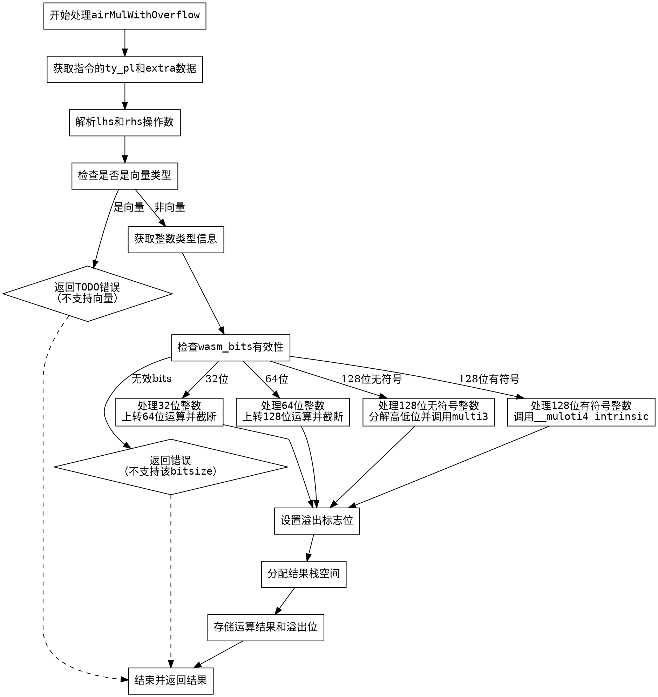

嗯，我需要为这个Zig函数`airMulWithOverflow`生成一个Graphviz的流程图。首先，我得仔细读一遍代码，理解每个步骤的逻辑。这个函数处理的是带有溢出检查的乘法操作，针对不同的整数类型有不同的处理路径。

首先，函数开始部分获取指令的数据类型和操作数，然后处理向量类型的错误情况。接着根据整数类型的位数（32、64、128）以及有无符号，分成了不同的处理分支。特别是128位无符号和有符号的情况比较复杂，涉及到调用intrinsic函数和多个中间计算步骤。

我需要将这些条件分支和操作步骤转化为流程图中的节点和判断框。可能的结构包括开始节点、条件判断（如检查整数位数和符号）、各分支的处理步骤，以及最终的存储结果和返回。

需要注意的是，代码中有多个if-else块，比如检查wasm_bits是否为32、64，以及128位时的有无符号处理。这些都需要在流程图中明确表示出来。此外，每个分支内部的操作步骤，比如类型转换、乘法运算、截断、比较等，也需要作为流程节点。

另外，流程图中要处理异常情况，比如返回错误或未实现的特性，例如处理向量类型时的TODO错误，或者不支持的整数位数时的错误。

最后，函数将结果存储到栈上，并返回结果。这部分也要在流程图中体现。

需要确保流程图的结构清晰，条件分支正确连接，各处理步骤按顺序排列，错误处理路径也要明确标出。可能需要使用菱形表示判断节点，矩形表示处理步骤，箭头表示流程方向。
================================================
