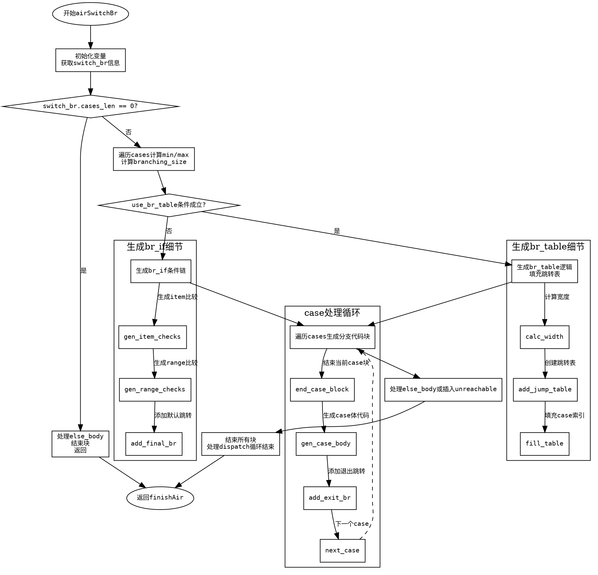

嗯，我需要为给定的Zig函数`airSwitchBr`绘制流程图。首先，我得仔细阅读这段代码，理解它的逻辑结构，然后将其转化为Graphviz的DOT语言。

函数`airSwitchBr`处理switch语句的生成，分为两种情况：使用`br_table`进行跳转或者使用多个`br_if`条件判断。代码中有多个条件分支和循环结构，比如处理case项、范围以及else分支。同时，函数还涉及块（block）的开始和结束，比如`startBlock`和`endBlock`，这些需要在流程图中正确体现。

首先，确定函数的主要步骤：

1. **初始化与准备**：获取switch_br的信息，处理目标值，分配局部变量等。
2. **处理case和范围**：遍历所有case项和范围，计算最小值和最大值，确定是否使用br_table。
3. **生成跳转逻辑**：根据是否使用br_table，生成不同的跳转指令（br_table或br_if）。
4. **生成各个分支的代码块**：包括case对应的body和else分支。
5. **结束块与清理**：结束各个块，处理循环结构，返回结果。

需要注意的条件和循环：

- `is_dispatch_loop`参数影响是否生成dispatch循环块。
- `use_br_table`的判断条件涉及宽度、分支数量等。
- 遍历cases时处理items和ranges。
- else分支的处理取决于`has_else_body`。

接下来，将这些步骤转化为流程图节点。每个主要代码块对应一个节点，条件判断作为分支节点。例如：

- 开始函数。
- 判断`switch_br.cases_len == 0`？
- 计算min和max，判断是否使用br_table。
- 生成br_table或br_if逻辑。
- 处理各个case和else分支。
- 结束块，处理dispatch循环结束。

需要注意错误处理和资源释放（如`defer`语句），但在流程图中可能不需要体现这些细节，主要关注控制流。

可能的节点和边：

1. 开始 -> 初始化变量。
2. 初始化 -> 判断cases_len是否为0。
   - 是：处理else_body，结束块，返回。
   - 否：继续计算min/max。
3. 计算min/max后，判断use_br_table。
   - 是：生成br_table逻辑。
   - 否：生成br_if逻辑。
4. 生成跳转后，遍历cases生成分支代码。
5. 处理else分支或trap。
6. 结束所有块，返回。

在Graphviz中，使用不同的形状表示不同节点，如矩形表示操作，菱形表示判断，圆形表示开始/结束。需要确保每个条件分支正确连接，循环结构合理。

现在，根据这些思考，编写DOT语言的结构，确保逻辑正确，避免遗漏分支或节点。
================================================
