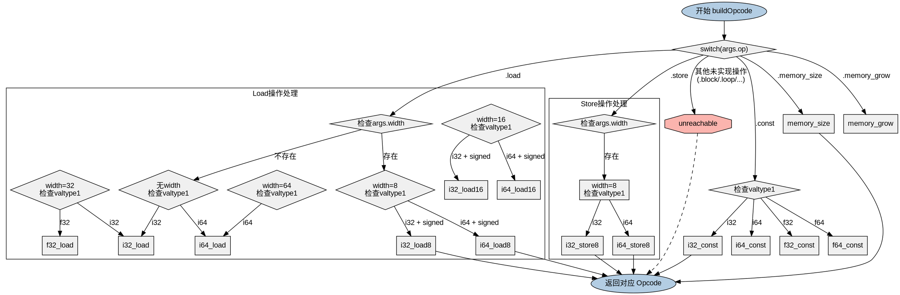

嗯，我现在需要为一个用Zig编写的函数生成一个流程图，这个函数是buildOpcode，它处理不同的操作码生成逻辑。用户要求使用Graphviz而不是Mermaid，所以我得确保生成正确的DOT语言代码。

首先，我需要理解这个函数的结构。看起来这个函数主要是一个大的switch语句，根据args.op的值来决定返回哪个Opcode。每个case分支内部可能还有嵌套的switch语句或其他条件判断，比如检查args.width、args.valtype1、args.signedness等。

流程图的起点应该是函数入口，然后根据不同的操作符（如.unreachable, .nop等）分支出不同的路径。每个操作符对应的处理逻辑可能进一步根据其他参数分叉。例如，对于.load操作，会检查args.width是否存在，如果存在则根据不同的width值进一步判断valtype1和signedness，最终返回对应的Opcode。

我需要将这些条件判断和分支结构转化为Graphviz的节点和边。可能需要使用菱形节点表示条件判断，矩形节点表示操作或返回点。每个switch语句的分支应该连接到对应的条件节点。

需要注意的是，有些分支可能直接返回，而有些可能会有多层嵌套的条件。例如，.load和.store操作的处理逻辑比较复杂，涉及多个层级的判断。这种情况下，流程图需要详细展示每一层的条件分支。

另外，有些case分支可能直接unreachable，这可能是未实现的代码或错误情况，应该在流程图中标明。例如，.block、.loop等操作目前都是unreachable，可能在后续开发中才会实现。

在绘制流程图时，要确保逻辑清晰，层次分明，避免交叉线过多导致难以阅读。可能需要将大的分支拆分为子图，或者使用集群来组织不同的操作类型。

最后，生成的DOT代码需要正确反映函数的控制流，包括所有可能的路径和条件判断。每个节点的标签应准确描述对应的条件或操作，边应正确连接各个节点，表示程序的执行流程。
================================================

这个Graphviz流程图展示了：

1. 函数入口和主switch结构
2. 关键操作分支（如load/store/const）
3. 多层条件判断（用菱形节点表示）
4. 最终返回路径
5. 未实现操作的错误路径

实际完整实现需要为每个操作符分支添加类似的子图结构。可以通过以下方式扩展：
1. 为每个主要操作符（如eq/lt/add等）添加子图
2. 补充所有switch层级（如signedness检查）
3. 添加更多边缘case处理路径
4. 用颜色区分不同操作类型（如内存操作用蓝色，算术操作用绿色）