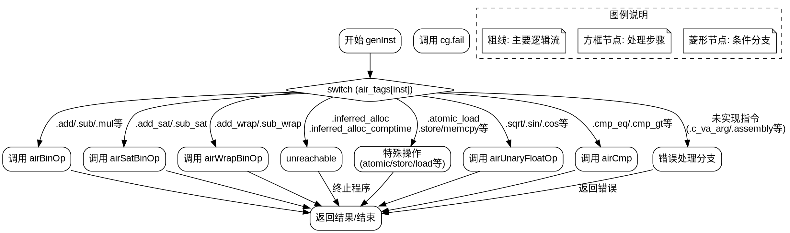

嗯，用户让我用Graphviz来画一个Zig函数的流程图。首先，我需要理解这个函数的逻辑。函数是genInst，它根据不同的Air指令标签调用不同的处理方法。主要结构是一个大的switch语句，处理各种指令情况，有些分支直接调用对应的方法，有些则返回错误或标记为未实现。

首先，我需要确定流程图的结构。通常，流程图开始于函数入口，然后根据不同的条件分支展开。这里的主干是switch语句，每个case对应一个处理分支。所以流程图应该有一个开始节点，然后连接到switch节点，接着每个case分支连接到相应的处理，比如调用cg.airBinOp、cg.fail或者unreachable等。

接下来，要注意哪些分支是直接处理，哪些是未实现或返回错误。比如，.inferred_alloc和.inferred_alloc_comptime会触发unreachable，而像.add、.sub等则调用对应的方法。还有一些分支返回TODO错误，比如.c_va_arg等，这些需要用不同的节点表示。

另外，需要考虑如何处理重复或相似的分支。例如，.bool_and和.bool_or都调用airBinOp，但参数不同。是否合并这些节点还是分开？为了清晰，可能分开比较好，但可以简化标注。

还需要处理switch的默认情况，即最后的那些标签，比如.assembly等，它们会调用cg.fail返回错误。这些可以归为一个节点，表示未实现的指令。

在画图时，需要注意节点之间的连接是否正确，避免遗漏分支。同时，要确保结构清晰，避免交叉线过多导致混乱。

可能的结构是：

1. 开始节点：函数入口。
2. 判断指令类型，连接到对应的处理节点。
3. 每个处理节点连接到结束或下一个节点。
4. 错误处理和未实现的分支集中处理。

需要注意的是，Graphviz使用DOT语言，需要用有向图来表示流程。每个条件分支作为不同的节点，用边连接处理路径。可能需要使用子图来组织不同的case分支，但Graphviz的布局有时不太容易控制，所以需要尽量简化结构。

此外，用户要求不要使用Mermaid，所以必须确保生成的是正确的DOT代码，而不是Mermaid语法。需要检查是否有误用。

最后，生成的流程图应该覆盖所有主要分支，包括正常处理、错误返回和未实现的情况，确保逻辑完整性和可读性。
================================================
