好的，我需要为给定的 Zig 函数 `lowerConstant` 生成一个流程图。首先，我需要仔细阅读代码，理解其逻辑结构，然后将其转化为流程图的不同节点和判断分支。

首先，函数开始处有一些前置条件检查，比如断言 `!isByRef(ty, zcu, cg.target)`，以及处理 `val.isUndefDeep(zcu)` 的情况，返回未定义值。这部分可以作为流程的起点。

接下来是主要的 switch 语句，根据 `ip.indexToKey(val.ip_index)` 的不同情况进行处理。每个 case 对应不同的值类型，比如 `.int_type`, `.simple_value`, `.int`, `.err`, 等等。需要将这些 case 转化为不同的分支。

例如，对于 `.simple_value`，内部还有一个 switch 处理不同的简单值，如 `.false` 和 `.true`，返回对应的立即数。这里需要判断这些值并生成相应的流程节点。

对于 `.int` 的情况，根据有符号和无符号以及位数不同，返回 `imm32` 或 `imm64`。这部分需要根据不同的条件分支处理。

还有处理错误、枚举、浮点数、指针、可选类型、聚合类型（数组、向量、结构体等）的情况，每个都有不同的处理逻辑。其中有些情况可能直接返回结果，有些可能需要递归调用 `lowerConstant`，比如处理联合类型或错误联合类型。

需要注意的是，某些情况会导致 unreachable 或调用 `cg.fail` 抛出错误，这些需要在流程图中表示为终止节点或错误处理路径。

在绘制流程图时，应按照代码的执行顺序，从上到下，每个条件判断作为一个菱形节点，不同的分支作为子流程。对于递归调用的情况，可以用子流程或指向之前的节点来表示。

需要特别注意代码中的返回语句和错误处理，确保每个可能的路径都被覆盖。例如，当处理结构体类型时，如果是非 packed 结构体，可能触发断言，而 packed 结构体则继续处理。

最后，确保流程图的每个节点都有明确的出口，无论是继续下一个处理步骤、返回结果，还是抛出错误。这样生成的流程图才能准确反映函数的逻辑流程。
================================================

```graphviz
digraph flowchart {
    node [shape=rectangle, fontname="Arial", style=filled, fillcolor="#E5E5E5"];
    edge [fontname="Arial"];

    start [label="Start lowerConstant", shape=ellipse];
    check_byref [label="Assert !isByRef(ty)"];
    check_undef [label="Check val.isUndefDeep(zcu)"];
    return_undef [label="Return cg.emitUndefined(ty)"];
    switch_main [label="Switch ip.indexToKey(val.ip_index)", shape=diamond];
    
    subgraph cluster_simple_value {
        label=".simple_value";
        simple_switch [label="Switch simple_value", shape=diamond];
        handle_false [label="Return .imm32 = 0"];
        handle_true [label="Return .imm32 = 1"];
    }
    
    subgraph cluster_int {
        label=".int";
        int_signedness [label="Switch signedness", shape=diamond];
        signed_bits [label="Switch bits (0-32 / 33-64)"];
        unsigned_bits [label="Switch bits (0-32 / 33-64)"];
        return_imm32 [label="Return .imm32"];
        return_imm64 [label="Return .imm64"];
    }
    
    handle_err [label="Get error value\nReturn .imm32 = int"];
    handle_error_union [label="Error union handling"];
    handle_enum_tag [label="Recurse with enum_tag.int"];
    handle_float [label="Return float32/float64"];
    handle_ptr [label="Call lowerPtr()"];
    handle_opt [label="Optional type handling"];
    handle_aggregate [label="Handle array/vector/struct"];
    handle_un [label="Handle packed union"];
    unreachable_node [label="Unreachable", shape=octagon];
    fail_node [label="cg.fail()", shape=octagon];
    
    start -> check_byref;
    check_byref -> check_undef;
    check_undef -> return_undef [label="isUndef"];
    check_undef -> switch_main [label="Valid value"];
    
    switch_main -> simple_switch [label=".simple_value"];
    simple_switch -> handle_false [label=".false"];
    simple_switch -> handle_true [label=".true"];
    simple_switch -> unreachable_node [label="其他非运行值"];
    
    switch_main -> int_signedness [label=".int"];
    int_signedness -> signed_bits [label="signed"];
    int_signedness -> unsigned_bits [label="unsigned"];
    signed_bits -> return_imm32 [label="0-32"];
    signed_bits -> return_imm64 [label="33-64"];
    unsigned_bits -> return_imm32 [label="0-32"];
    unsigned_bits -> return_imm64 [label="33-64"];
    
    switch_main -> handle_err [label=".err"];
    switch_main -> handle_error_union [label=".error_union"];
    handle_error_union -> fail_node [label="Payload有运行时位"];
    
    switch_main -> handle_enum_tag [label=".enum_tag"];
    switch_main -> handle_float [label=".float"];
    handle_float -> return_imm32 [label="f16"];
    handle_float -> return_float32 [label="f32"];
    handle_float -> return_float64 [label="f64"];
    
    switch_main -> handle_ptr [label=".ptr"];
    switch_main -> handle_opt [label=".opt"];
    handle_opt -> return_imm32 [label="Optional为null"];
    
    switch_main -> handle_aggregate [label=".aggregate"];
    handle_aggregate -> fail_node [label="array_type"];
    handle_aggregate -> store_simd [label="vector_type"];
    handle_aggregate -> packed_struct [label="struct_type"];
    
    switch_main -> handle_un [label=".un"];
    switch_main -> unreachable_node [label="类型类目"];
    
    { rank=same; return_undef; return_imm32; return_imm64; return_float32; return_float64; }
}
```
