好的，我需要为提供的Zig函数`lowerToCode`绘制一个流程图。首先，我需要理解这个函数的结构和逻辑流程。

函数开头定义了一些变量，如`mir`、`code`、`wasm`等。然后进入一个循环，根据`tags[inst]`的值进行不同的处理。每个case对应不同的操作，例如`.dbg_epilogue_begin`直接返回，`.block`和`.loop`处理块类型，`.uav_ref`根据是否为对象文件调用不同的函数，等等。每个case处理完后，`inst`递增，继续下一个指令。

我需要将每个`switch`分支作为流程图的节点，并展示它们的执行顺序和可能的跳转。例如，`.dbg_epilogue_begin`会结束流程，而其他分支处理后继续循环。同时，注意循环中的`continue :loop tags[inst]`，表示处理完当前指令后，继续下一个指令。

需要注意条件判断，如`is_obj`在不同情况下执行不同的代码路径。例如在`.uav_ref`中，根据`is_obj`的值调用不同的函数。此外，有些分支会触发panic或TODO，这也是流程中的终止点或待处理节点。

最后，需要将所有的分支用箭头连接起来，表示控制流的走向。特别是循环结构，需要明确从每个分支返回到循环开始的条件。

可能的结构是：开始 -> 循环开始 -> 根据tags[inst]选择分支 -> 处理分支 -> 更新inst -> 继续循环或退出。对于每个分支，处理完后的动作需要连接到下一个指令的处理，或者结束流程。

需要确保所有可能的路径都被覆盖，包括错误处理和panic情况。同时，注意函数中的`comptime unreachable`等标记，这可能表示某些代码在编译时不可达，但在流程图中仍需表示可能的路径。

最终，流程图应该清晰地展示函数从开始到结束的所有可能执行路径，每个判断和操作步骤都有对应的节点和连接。
================================================

```dot
digraph flowchart {
    node [shape=rectangle, style="rounded", fontname="Arial"];
    edge [fontname="Arial"];

    start [label="开始lowerToCode"];
    loop_start [label="循环开始: inst初始化"];
    switch_node [label="switch(tags[inst])"];
    return_node [label="返回"];
    block_loop [label="处理block/loop类型\n写入操作码和块类型"];
    uav_ref [label="处理uav_ref\n根据is_obj调用不同函数"];
    uav_ref_off [label="处理uav_ref_off\n根据is_obj调用不同函数"];
    nav_ref [label="处理nav_ref\n调用navRefOff"];
    nav_ref_off [label="处理nav_ref_off\n调用navRefOff"];
    func_ref [label="处理func_ref\n写入i32_const操作码"];
    dbg_line [label="跳过dbg_line"];
    errors_len [label="处理errors_len\n写入i32_const和错误长度"];
    error_name_table_ref [label="处理error_name_table_ref\n根据is_obj处理重定位"];
    br_ops [label="处理br_if/br/memory_grow/memory_size\n写入操作码和标签"];
    local_ops [label="处理local_get/local_set/local_tee\n写入操作码和局部索引"];
    br_table [label="处理br_table\n写入跳转表"];
    call_nav [label="处理call_nav\n写入call操作码"];
    call_indirect [label="处理call_indirect\n写入call_indirect操作码"];
    call_tag_name [label="处理call_tag_name\n写入call操作码"];
    call_intrinsic [label="处理call_intrinsic\n写入call操作码"];
    global_set_sp [label="处理global_set_sp\n写入global_set操作码"];
    const_ops [label="处理常量操作(f32/i32/i64等)\n写入对应操作码和值"];
    load_store [label="处理load/store指令\n写入操作码和内存参数"];
    simple_ops [label="处理单字节操作(end/return等)\n直接写入操作码"];
    misc_prefix [label="处理misc_prefix\n写入前缀和扩展操作码"];
    simd_prefix [label="处理simd_prefix\n写入前缀和SIMD操作码"];
    atomics_prefix [label="处理atomics_prefix\n写入前缀和原子操作码"];
    panic_node [label="触发panic或TODO"];
    inst_inc [label="inst += 1\n继续下一个指令"];
    loop_end [label="循环结束"];

    start -> loop_start;
    loop_start -> switch_node;

    switch_node -> return_node [label=".dbg_epilogue_begin"];
    switch_node -> block_loop [label=".block/.loop"];
    switch_node -> uav_ref [label=".uav_ref"];
    switch_node -> uav_ref_off [label=".uav_ref_off"];
    switch_node -> nav_ref [label=".nav_ref"];
    switch_node -> nav_ref_off [label=".nav_ref_off"];
    switch_node -> func_ref [label=".func_ref"];
    switch_node -> dbg_line [label=".dbg_line"];
    switch_node -> errors_len [label=".errors_len"];
    switch_node -> error_name_table_ref [label=".error_name_table_ref"];
    switch_node -> br_ops [label=".br_if/.br/.memory_grow/.memory_size"];
    switch_node -> local_ops [label=".local_get/.local_set/.local_tee"];
    switch_node -> br_table [label=".br_table"];
    switch_node -> call_nav [label=".call_nav"];
    switch_node -> call_indirect [label=".call_indirect"];
    switch_node -> call_tag_name [label=".call_tag_name"];
    switch_node -> call_intrinsic [label=".call_intrinsic"];
    switch_node -> global_set_sp [label=".global_set_sp"];
    switch_node -> const_ops [label=".f32_const/.i32_const等"];
    switch_node -> load_store [label=".i32_load/.i64_store等"];
    switch_node -> simple_ops [label=".end/.return等单字节指令"];
    switch_node -> misc_prefix [label=".misc_prefix"];
    switch_node -> simd_prefix [label=".simd_prefix"];
    switch_node -> atomics_prefix [label=".atomics_prefix"];

    return_node -> loop_end;
    block_loop -> inst_inc;
    uav_ref -> inst_inc;
    uav_ref_off -> inst_inc;
    nav_ref -> inst_inc;
    nav_ref_off -> inst_inc;
    func_ref -> inst_inc;
    dbg_line -> inst_inc;
    errors_len -> inst_inc;
    error_name_table_ref -> inst_inc;
    br_ops -> inst_inc;
    local_ops -> inst_inc;
    br_table -> inst_inc;
    call_nav -> inst_inc;
    call_indirect -> inst_inc;
    call_tag_name -> inst_inc;
    call_intrinsic -> inst_inc;
    global_set_sp -> inst_inc;
    const_ops -> inst_inc;
    load_store -> inst_inc;
    simple_ops -> inst_inc;
    misc_prefix -> inst_inc [label="成功处理"];
    misc_prefix -> panic_node [label="未实现的操作"];
    simd_prefix -> inst_inc [label="成功处理"];
    simd_prefix -> panic_node [label="未实现的操作"];
    atomics_prefix -> inst_inc [label="成功处理"];
    atomics_prefix -> panic_node [label="未实现的操作"];
    
    inst_inc -> loop_start [label="继续循环"];
    panic_node -> loop_end [label="终止流程"];
}
```
