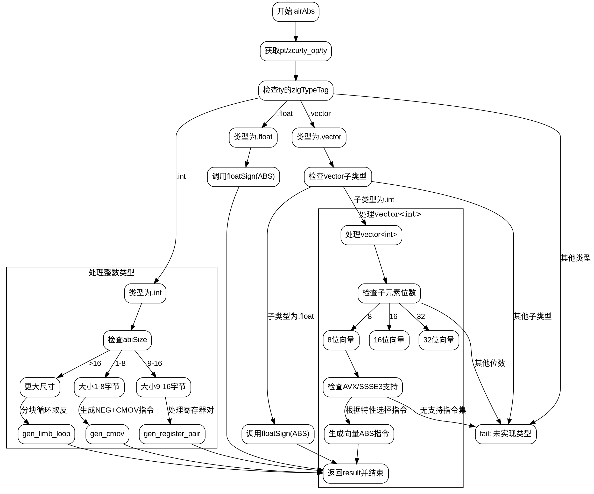

嗯，我需要为给定的Zig函数`airAbs`绘制一个流程图。这个函数处理不同数据类型的绝对值操作，包括整数、浮点数和向量类型。我需要理解代码的结构，然后分解成不同的流程步骤。

首先，函数开始部分获取了类型信息，然后根据不同的类型标签（如.int, .float, .vector）进行分支处理。对于整数类型，根据其大小（1-8字节、9-16字节、更大）有不同的处理方式。例如，较小的整数可能使用条件移动指令（cmov），而较大的整数可能需要更复杂的循环处理。对于浮点数和向量类型，可能有特定的指令集支持，如SSSE3或AVX。

接下来，我需要识别每个条件判断和对应的代码块。例如，当处理整数类型时，首先检查abiSize，然后进入不同的分支。每个分支内部有不同的操作步骤，比如生成不同的机器指令、处理寄存器分配、循环结构等。

对于流程图的结构，主节点是函数入口，然后根据不同的类型标签分支出多个子节点。每个子节点再根据大小或特性进一步分支。例如，整数类型下分为三个大小范围，每个范围有不同的处理逻辑。浮点数和向量类型也有各自的分支，特别是向量类型下还根据子类型（如int或float）和位数再次分支。

需要注意循环结构，比如在处理大整数时的neg_loop循环。这部分需要表示循环的开始和结束条件。此外，错误处理部分（如self.fail）也应作为流程的一个终止节点。

最后，确保流程图中的每个判断节点（如类型检查、大小检查）和操作节点（如寄存器分配、指令生成）正确连接，并标注条件分支的路径。可能还需要处理一些细节，比如寄存器锁定和解锁、临时寄存器的使用等。
================================================
