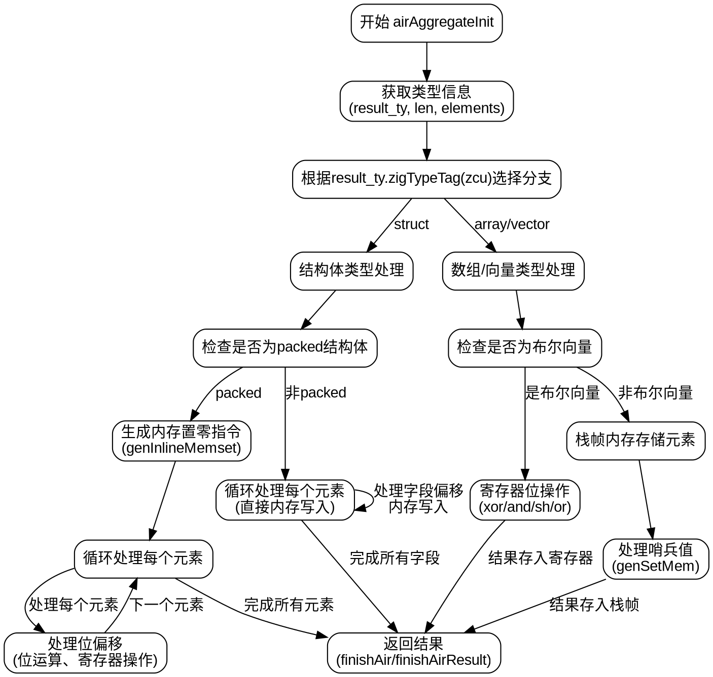

好的，我现在需要为提供的Zig函数`airAggregateInit`绘制流程图。首先，我需要仔细理解这个函数的结构和逻辑流程。

首先，函数`airAggregateInit`处理聚合类型的初始化，比如结构体、数组或向量。函数开始部分获取了一些类型信息和元素列表。然后根据结果类型的不同（结构体、数组/向量）分别处理。

对于结构体类型，分为打包（packed）和非打包两种情况。打包结构体需要处理位偏移，可能涉及位操作和内存写入。非打包结构体则按字段偏移进行内存写入。数组和向量部分处理元素逐个存储到内存中，如果是布尔向量则使用寄存器进行位操作。

接下来，我需要确定每个分支的条件和处理步骤。例如，当`result_ty`是结构体且为打包布局时，生成内存设置，然后循环处理每个元素，处理位偏移和可能的位操作。对于数组和向量，分情况处理布尔向量和其他类型，布尔向量使用寄存器进行位操作，其他类型则存储到栈帧。

然后，函数末尾处理结果返回，根据元素数量决定使用小数组还是大tombstone。

在绘制流程图时，需要将每个条件判断（如switch语句）作为决策节点，每个处理步骤作为过程节点，循环处理元素作为循环结构。需要注意不同分支的流程，如打包结构体和数组的不同处理路径。

可能需要注意的细节包括：

1. `switch (result_ty.zigTypeTag(zcu))` 分支到结构体、数组/向量等。
2. 结构体处理中，判断是否为打包布局，分别处理。
3. 数组/向量处理中，布尔向量的特殊处理。
4. 循环遍历每个元素，处理内存写入或寄存器操作。
5. 最后的返回部分根据元素数量决定如何处理。

需要确保流程图准确反映这些逻辑分支和循环结构，每个节点清晰表示对应的代码块，箭头正确连接各个步骤。
================================================
