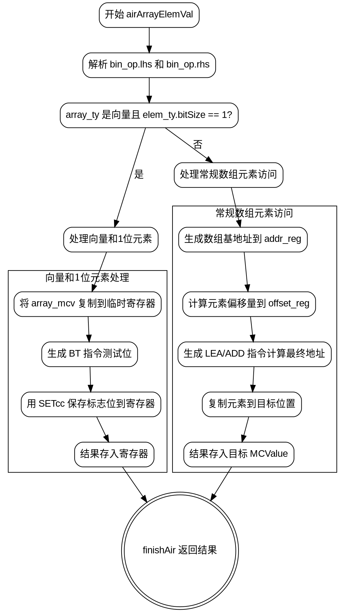

嗯，我现在需要为一个用Zig编写的函数生成流程图。函数名是airArrayElemVal，属于x86_64架构的代码生成部分。首先，我需要理解这个函数的结构和逻辑流程，这样才能正确地绘制出流程图。

首先，函数开始于定义一些变量，比如pt、zcu、bin_op。然后进入一个大的result代码块。这里处理的是数组元素的取值操作。接下来，函数获取数组的类型array_ty和元素类型elem_ty。然后解析左操作数（数组）和右操作数（索引），分别得到array_mcv和index_mcv。这里还涉及到寄存器锁的管理，需要处理可能的寄存器锁定和解锁。

然后，函数检查数组类型是否为向量且元素大小为1位。如果是，处理方式不同，可能使用BT指令进行位测试。这里有不同的情况分支，比如立即数索引和寄存器索引，处理方式也不同。之后设置条件码，并将结果存入寄存器。

如果不是向量或者元素大小不是1位，则处理常规的数组元素访问。计算元素的偏移量，生成地址，然后复制元素到目标位置。这里涉及分配寄存器、计算偏移、生成地址、复制数据等步骤。

在流程中，有很多条件判断和分支，比如不同类型的array_mcv（寄存器、内存地址、符号加载等），以及不同的index_mcv类型。每个分支处理方式不同，需要生成相应的汇编指令。

可能的错误点包括：没有正确处理所有类型的array_mcv或index_mcv，导致遗漏分支；寄存器管理不当，比如未正确解锁；在生成地址或计算偏移时出现错误；条件判断逻辑错误，比如向量类型的判断条件不正确。

为了绘制流程图，我需要将整个函数的逻辑分解成步骤，并用图形化的方式表示各个判断和操作。例如，开始节点，处理数组和索引，判断是否为向量和1位元素，然后根据不同的情况分支处理，最后生成结果并返回。每个条件判断对应一个分支节点，操作步骤对应处理节点，结束于返回结果。

需要注意流程图的正确性，确保所有可能的分支都被覆盖，并且步骤之间的逻辑关系正确。同时，流程图应简洁明了，避免过于复杂，便于理解。
================================================
