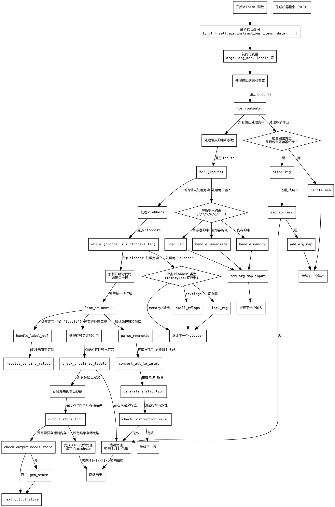

嗯，我需要根据用户提供的Zig代码中的`airAsm`函数来生成一个Graphviz的流程图。首先，我需要理解这个函数的结构和逻辑流程。这个函数看起来是处理内联汇编的代码生成部分，涉及寄存器分配、约束处理、输入输出参数管理等。

首先，我应该分段分析代码，识别主要的步骤和条件分支。比如，函数开始时解析指令，处理输出和输入参数，处理clobbers，处理汇编源代码中的标签和指令，最后处理结果和清理资源。

接下来，我需要确定流程图中的各个节点，比如开始、结束、条件判断、循环、错误处理等。每个主要的代码块或循环应该对应一个节点，条件判断对应分支，函数调用或错误处理作为不同的节点。

然后，要注意代码中的错误处理部分，例如`return self.fail(...)`，这些应该作为流程中的终止节点或者错误出口。同时，循环结构如`for (outputs)`和`while (line_it.next())`需要被正确表示为循环节点。

在绘制流程图时，可能需要将代码中的各个部分分解为更小的步骤，例如：
1. 初始化变量和解析指令数据。
2. 处理输出约束和参数。
3. 处理输入约束和参数。
4. 处理clobbers。
5. 解析汇编源代码，处理标签和指令。
6. 生成机器指令。
7. 处理结果并返回。

每个步骤中的条件判断，比如约束检查、寄存器分配是否成功，都需要作为决策节点。同时，错误路径需要明确标出。

需要注意的是，Graphviz的语法使用有向边连接节点，节点用形状区分类型，例如矩形表示过程，菱形表示判断，椭圆形表示开始/结束等。

在实现过程中，可能会遇到复杂的嵌套循环和条件，需要确保流程图的层次结构清晰，避免交叉线过多导致难以阅读。可能需要对部分代码块进行合并或拆分，以保持图表简洁。

最后，根据分析结果，使用Graphviz的DOT语言编写流程图，确保每个步骤和条件都被正确表示，并进行验证，确保逻辑与代码一致。
================================================
