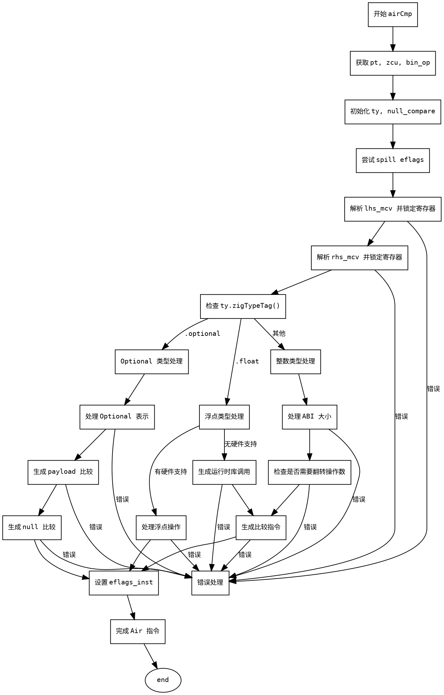

好的，我需要为提供的Zig函数`airCmp`生成一个Graphviz流程图。首先，我需要理解这个函数的结构和逻辑流程。

首先，函数开始于获取一些上下文变量，如`pt`和`zcu`，然后解析二元操作`bin_op`。接下来处理类型`ty`，并初始化`null_compare`变量。

然后，函数进入一个大的条件块，根据`ty`的类型标签（如`.float`或`.optional`）进行不同的处理。对于浮点类型，检查支持的硬件特性，并可能生成库调用。对于可选类型，处理可能的空值比较，涉及到寄存器的分配和释放，以及生成汇编指令。

在处理完类型相关的逻辑后，根据不同的类型（如整数或浮点数）生成不同的比较操作，涉及寄存器的锁定和解锁，以及生成相应的汇编指令。最后，处理`null_compare`的重定位，并设置`eflags_inst`，完成`Air`指令的生成。

接下来，我需要将这些逻辑步骤转化为流程图中的节点和边。需要注意条件分支（如`switch`语句）、循环（如`while (limb_i < limbs_len)`）以及错误处理和资源释放（如`defer`语句）。

需要注意以下几点：
1. **节点划分**：每个主要操作或条件判断应作为一个节点。
2. **分支处理**：每个`switch`或`if`条件需要分支出不同的路径。
3. **循环结构**：`while`循环需要形成一个循环的边。
4. **资源管理**：`defer`语句中的解锁操作应体现在流程图中，可能在节点之后。
5. **错误处理**：`try`和错误返回需要作为可能的出口。

可能的结构步骤：
1. 函数入口，初始化变量。
2. 处理`ty`的不同类型标签（浮点、可选等）。
3. 对于每种类型，处理相应的比较逻辑，包括寄存器分配、汇编生成。
4. 处理整数类型的比较，考虑大小端、寄存器操作。
5. 处理浮点类型的比较，生成不同的汇编指令。
6. 处理可选类型的空值比较，生成跳转指令。
7. 最后的`null_compare`重定位和函数返回。

需要确保每个条件分支都有正确的流向，并且循环结构正确表示。同时，注意函数中的`defer`语句可能在流程图中表示为后续的清理步骤。

现在，根据以上分析，开始绘制Graphviz的节点和边。
================================================
