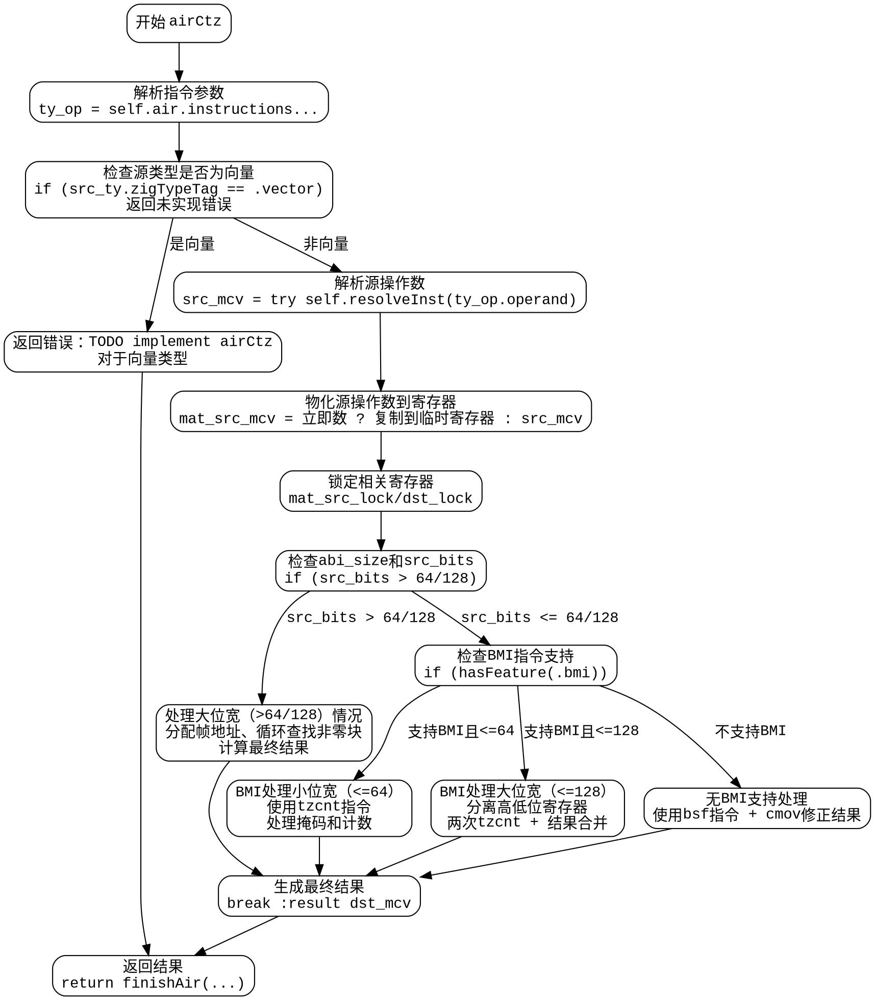

好的，我需要为提供的 Zig 函数 `airCtz` 生成一个 Graphviz 的流程图。首先，我需要理解这个函数的结构和逻辑流程。

函数开始处理 `airCtz` 指令，首先进行一些初始化操作，比如获取 `pt` 和 `zcu`，然后处理 `ty_op` 和 `result` 的逻辑。接下来，函数处理不同类型的源操作数，包括向量类型和立即数，可能需要将立即数复制到临时寄存器。之后，根据源类型的大小和是否支持 BMI 指令集，函数分为不同的处理路径：

1. **处理大位宽（超过64或128位）的情况**：这里涉及到分配帧地址、处理多个数据块（limbs），使用循环来查找非零的块，并计算最终的计数。

2. **使用 BMI 指令集的情况**：分为小位宽（<=64位）和大位宽（<=128位）两种情况，分别处理低位和高位的数据，使用 `tzcnt` 指令。

3. **无 BMI 支持的情况**：处理64位及以下的位宽，使用 `bsf` 指令并结合条件移动（cmov）来处理特殊情况。

在绘制流程图时，需要将这些主要分支和子分支清晰地表示出来，包括条件判断（如是否支持BMI、位宽大小判断等）、循环结构（如处理多个limbs的循环）、以及不同路径的结束点（break :result）。

需要注意节点之间的连接箭头要正确反映代码的执行顺序，尤其是条件分支后的不同路径。同时，对于循环结构，需要正确表示循环体的开始和结束，以及循环条件的判断位置。

最后，确保流程图的结构清晰，每个处理步骤和条件判断都有对应的节点，并使用合适的标签说明每个步骤的操作或条件。
================================================
