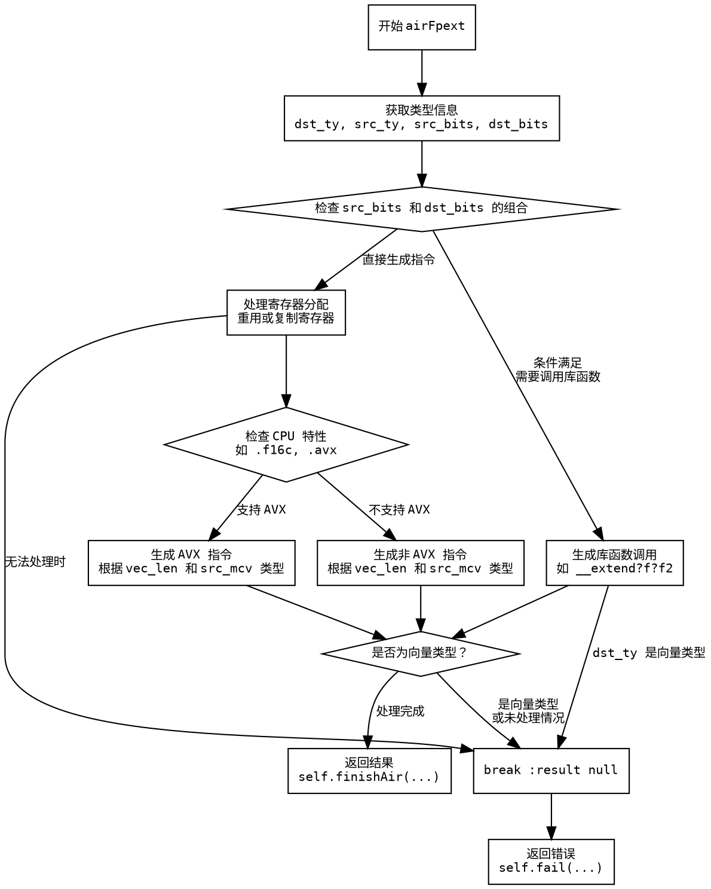

嗯，用户让我用Graphviz来画这个Zig函数的流程图。首先，我需要理解这个函数的结构和逻辑流程。这个函数是airFpext，看起来是处理浮点扩展的代码生成部分。

首先，函数开始处获取了一些类型和操作数信息，比如dst_ty、src_ty，以及它们的位宽。然后有一个大的结果块result，里面有很多条件判断。用户可能在这里根据不同的源和目标位宽选择不同的处理路径，比如调用库函数或者生成特定的汇编指令。

接下来，我需要分析代码中的各个分支。比如，当src_bits是16时，会检查目标位宽是否为32、64等，并根据是否有f16c特性来决定是否生成特定的指令。如果没有满足条件，可能会调用libc函数，比如__extend...之类的。

然后，在处理寄存器的部分，代码尝试重用操作数寄存器或者复制到新的寄存器。之后根据不同的情况生成不同的汇编指令，比如v_ps.cvtph2或者v_sd.cvtss2等。还有一些关于向量长度和AVX特性的判断。

需要注意到代码中有多处条件分支，比如switch语句和if条件，这些都需要在流程图中体现出来。同时，可能有一些错误处理路径，比如返回fail或者break到result。

画流程图的时候，应该从函数入口开始，逐步画出各个条件判断和处理步骤。每个条件分支都要有对应的节点和箭头，表示不同的执行路径。比如，处理src_bits为16的情况，可能需要不同的子流程，调用不同的汇编生成函数或者库函数。

另外，代码中的result块可能在某些条件下返回null，导致进入fail分支。这也是需要注意的一个分支点。

可能的结构是：开始 -> 获取类型信息 -> 判断src_bits和dst_bits的组合 -> 根据不同组合选择不同的处理方式（生成调用、处理寄存器、生成汇编） -> 处理结果 -> 结束或返回错误。

需要注意循环和递归的情况，但在这个函数里似乎没有循环，主要是条件分支。因此，流程图应该是线性的，但有多个分支节点。

最后，要确保所有的条件分支都被覆盖，比如各个switch的case，以及if条件的分支。可能有些路径会导致break :result null，这时候需要跳转到错误处理。

总结一下，流程图的结构大致如下：

1. 函数入口，初始化变量。
2. 判断src_bits和dst_bits的组合。
3. 根据组合情况，决定是否调用库函数或生成汇编指令。
4. 处理寄存器分配和汇编生成。
5. 如果有未处理的情况，进入错误处理。
6. 返回结果或错误。

现在需要用Graphviz的DOT语言将这些步骤可视化，用节点表示操作，箭头表示流程走向，条件判断用菱形节点，处理步骤用矩形节点，结束节点用椭圆形。
================================================
