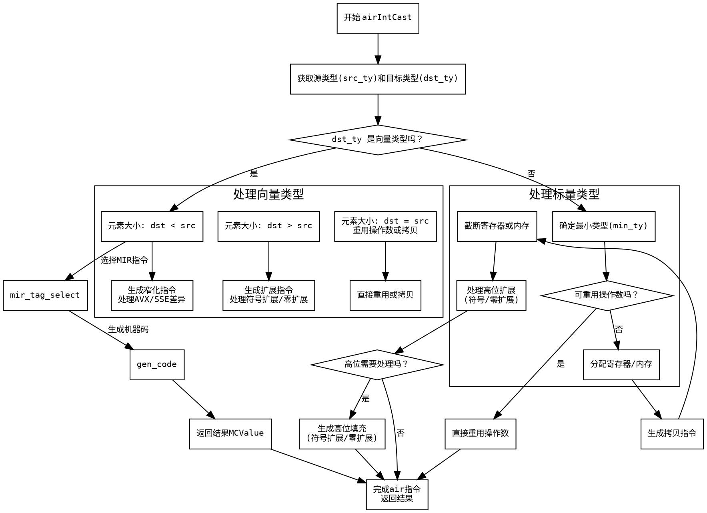

好的，我需要为提供的Zig函数`airIntCast`生成一个流程图。首先，我需要仔细阅读并理解这个函数的逻辑结构。函数的主要目的是处理整数类型转换的AIR指令，生成相应的机器码。

首先，函数开始获取一些类型和操作数信息，比如源类型`src_ty`和目标类型`dst_ty`。然后根据不同的条件分支处理不同的情况，比如向量类型处理、不同位数的整数转换、寄存器的重用与分配等。

接下来，我需要识别函数中的主要分支点。例如，函数首先检查目标类型是否为向量类型（`dst_ty.isVector(zcu)`）。如果是，进入向量处理的逻辑，这里又分为多个子情况，比如目标元素大小小于、等于或大于源元素大小，分别有不同的处理方式。

在处理非向量类型时，函数会计算源和目标类型的位数，决定是否需要进行截断或扩展操作。这里涉及到寄存器的分配、拷贝以及可能的符号扩展或零扩展。

流程图需要涵盖以下主要部分：
1. 函数入口，初始化变量。
2. 检查目标类型是否为向量，如果是则处理向量分支。
   a. 处理元素大小小于的情况。
   b. 处理元素大小相等的情况。
   c. 处理元素大小大于的情况。
3. 非向量类型的处理。
   a. 确定最小类型，处理寄存器重用或分配。
   b. 处理截断或扩展操作。
   c. 处理高位部分的填充（符号扩展或零扩展）。
4. 错误处理，返回结果。

需要注意条件判断的流程，比如`switch (std.math.order(dst_elem_abi_size, src_elem_abi_size))`产生的三个分支，以及每个分支内部的条件判断和操作。同时，需要处理各种寄存器的分配和释放，确保流程正确。

在绘制流程图时，使用Graphviz的节点和边来表示各个步骤和判断点。每个判断点（如if-else、switch）用菱形节点表示，处理步骤用矩形节点，箭头表示流程方向。确保所有可能的路径都被覆盖，包括错误处理和返回结果的部分。

需要特别注意函数中可能出现的`break :result`和`@compileError("unreachable")`，这些表示流程中的跳转和不可达代码，需在流程图中正确体现。

最后，验证流程图的逻辑是否正确，确保所有分支和循环都被正确表示，没有遗漏重要的步骤。
================================================
