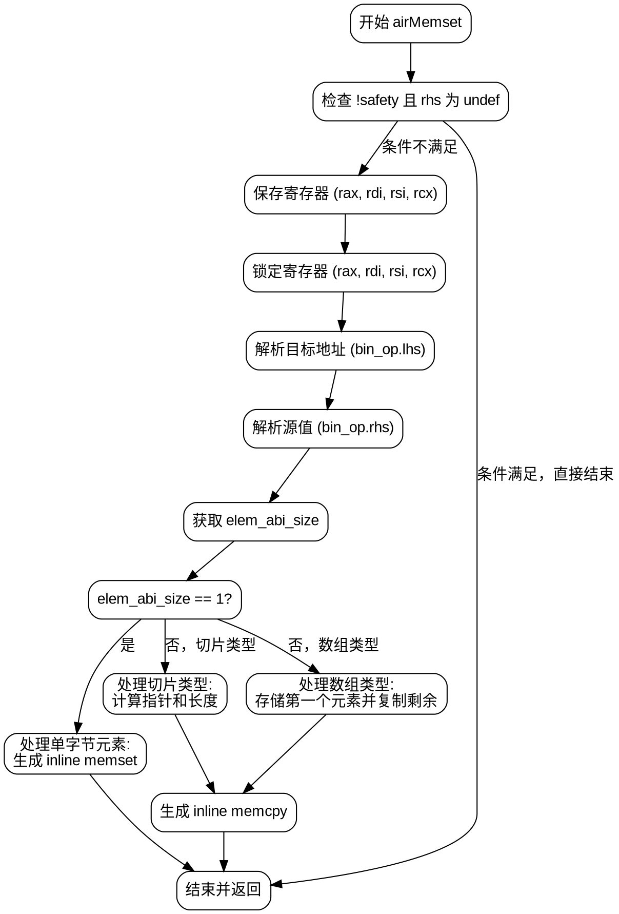

好的，我需要为给定的Zig函数`airMemset`绘制流程图。首先，我需要理解这个函数的结构和逻辑流程。

函数开始于定义一些变量，如`pt`、`zcu`、`bin_op`。然后进入一个`result`块，这里有一个条件判断：如果`safety`为假且`bin_op.rhs`解析为`.undef`，则跳出`result`块。否则，继续执行。

接下来，函数调用`spillRegisters`来保存一些寄存器，然后锁定这些寄存器，使用`defer`确保之后解锁。之后处理目标地址`dst`，根据其类型（寄存器、寄存器对等）锁定相应的寄存器，并在处理完成后解锁。

然后处理源值`src_val`，同样根据其类型锁定寄存器，并在之后解锁。接着获取`elem_abi_size`，即元素类型的ABI大小。如果这个大小为1，处理方式较为简单，生成内联的memset操作，并结束流程。

如果元素大小不为1，函数分为两种情况处理：切片类型和单一指针类型。对于切片类型，计算长度，处理指针和长度寄存器，生成内联的memcpy。对于单一指针类型，处理数组长度，存储第一个元素，然后计算剩余元素的内存复制。

在整个流程中，需要注意条件分支、循环结构（如果有的话）、错误处理以及各个步骤之间的依赖关系。需要将这些步骤转换为流程图中的节点，并用箭头表示控制流。

需要注意的关键点包括：
1. 初始的条件判断是否进入`result`块。
2. 寄存器的锁定和解锁流程。
3. 处理不同元素大小时的逻辑分支。
4. 切片和数组的不同处理路径。
5. 生成内联的memset和memcpy操作的位置。

可能存在的错误点包括未正确处理所有条件分支，或者误解某些步骤的执行顺序。需要仔细检查每个条件判断后的流程，确保所有可能的路径都被正确表示。

最后，根据上述分析，使用Graphviz的DOT语言绘制流程图，确保每个节点和边正确反映函数的逻辑结构。
================================================
