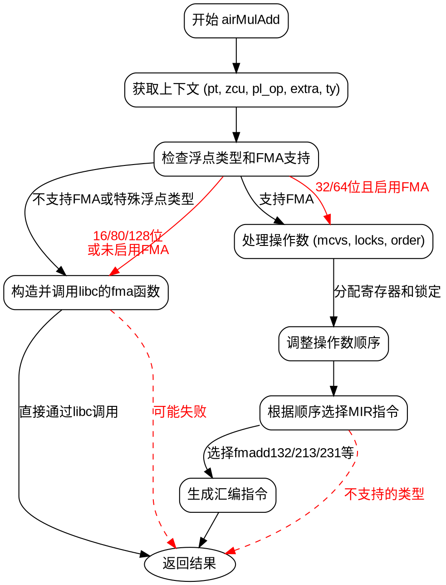

好的，我需要为提供的Zig函数`airMulAdd`生成一个流程图。首先，我得仔细阅读代码，理解它的逻辑结构。

函数开始于获取一些上下文信息，比如`pt`、`zcu`、`pl_op`和`extra`。然后根据类型`ty`的不同情况处理乘法加法操作。如果目标平台不支持FMA（乘积累加）指令，或者处理的是特定浮点类型（如16、80、128位），则调用libc的`fma`函数。否则，生成相应的机器指令。

接下来是处理操作数的部分，这里涉及到寄存器管理和操作数顺序的调整。根据操作数的类型和寄存器的可用性，决定如何分配寄存器，并生成对应的汇编指令。

在流程图中，我需要将主要的条件分支和循环结构表示出来。例如：

1. 检查浮点类型是否支持直接生成FMA指令，或者需要调用外部函数。
2. 对于需要调用外部函数的情况，构造函数名并生成调用。
3. 否则，处理操作数，分配寄存器，调整操作顺序。
4. 根据操作数顺序选择对应的机器指令（如fmadd132、fmadd213等）。
5. 生成汇编指令并返回结果。

需要注意各个条件分支之间的关系，比如不同的`switch`情况和`if`条件。此外，循环处理操作数和寄存器锁定的部分也需要在流程图中体现。

最后，确保流程图的节点和边正确反映代码的执行路径，包括错误处理和返回结果的部分。
================================================
