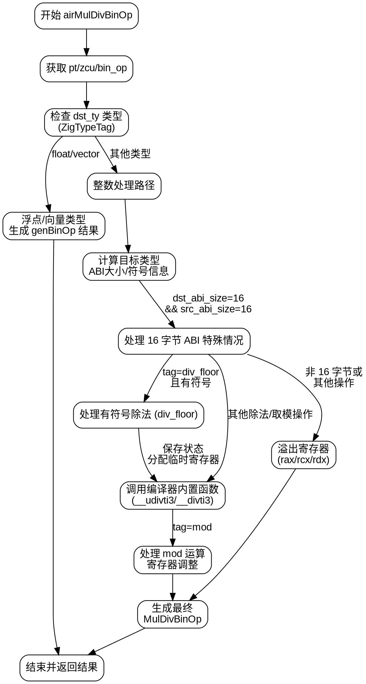

好的，我需要帮用户将提供的Zig函数`airMulDivBinOp`转换成Graphviz的流程图。首先，我需要理解这个函数的结构和逻辑，然后根据代码的执行流程来绘制流程图。

首先，我会通读代码，了解函数的主要步骤：

1. **函数开始**：定义函数参数，获取一些上下文信息，如`pt`、`zcu`和`bin_op`。
2. **处理结果**：根据目标类型`dst_ty`的Zig类型标签（浮点或向量）生成二进制操作结果，否则进入整数处理路径。
3. **处理整数运算**：
   - 确定目标类型的大小和符号信息。
   - 根据不同的操作标签（如`.mul`, `.div_trunc`等）处理不同的情况，特别是处理16字节的ABI大小。
   - 对于有符号除法的特殊情况（如`.div_floor`），生成额外的代码来处理符号和余数。
   - 调用编译器内置函数（如`__udivti3`等）来处理大整数运算。
4. **处理余数和模运算**：通过条件判断和寄存器操作调整结果。
5. **生成汇编指令**：根据不同的情况生成相应的汇编指令，处理寄存器的分配和释放。
6. **结束**：返回结果并完成Air指令。

接下来，我需要将这些步骤分解为流程图中的节点和边。每个条件判断（如switch语句）会产生分支，不同的操作标签会导致不同的处理路径。需要特别注意处理有符号除法时的额外步骤，以及寄存器管理和汇编指令生成的部分。

需要注意的是，代码中有多个条件分支和循环结构（如switch、if-else），需要准确地在流程图中表示出来。例如，当处理`tag`为`.div_floor`时，会有更多的子步骤，包括分配帧索引、保存状态、恢复状态等。这些步骤需要作为子流程或条件节点来展示。

此外，函数中涉及到的寄存器分配和释放、临时变量的管理也需要在流程图中体现，可能作为处理步骤的一部分或单独的节点。

最后，需要确保流程图的节点之间用箭头正确连接，表示程序的执行顺序和条件分支。可能还需要使用子图来分组相关的处理步骤，例如将有符号除法的特殊处理作为一个子流程。

在绘制过程中，可能会遇到复杂的嵌套条件，需要仔细分析代码结构，避免遗漏任何分支或步骤。同时，要确保流程图的可读性，合理布局节点，避免交叉和混乱。
================================================
