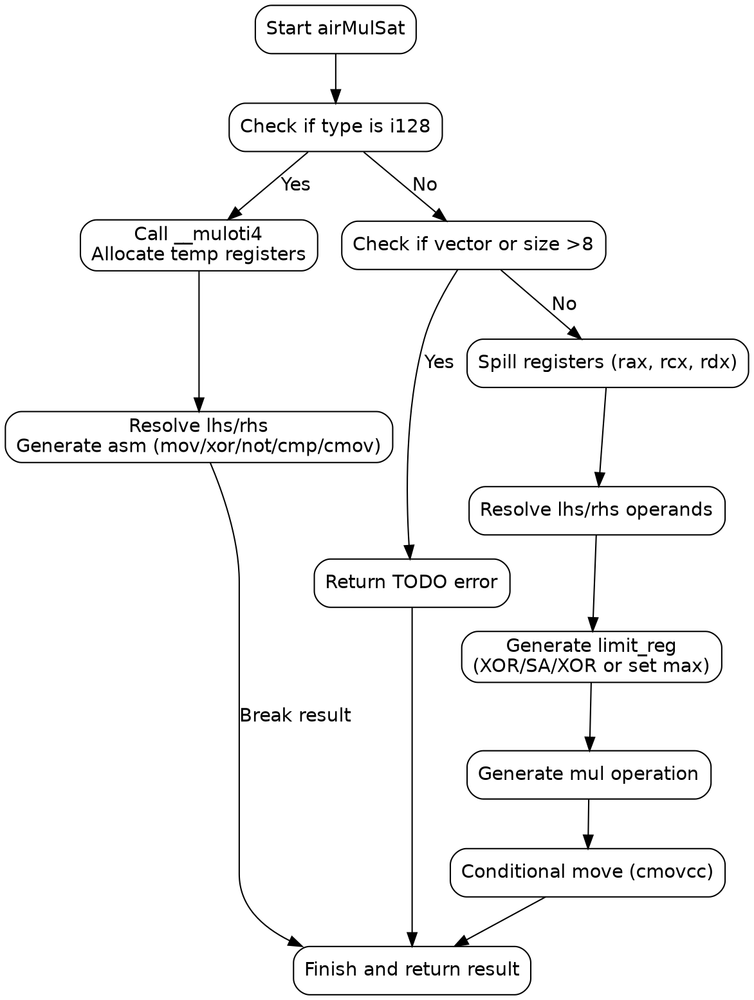

好的，我现在需要为提供的Zig函数`airMulSat`生成一个Graphviz的流程图。首先，我需要理解这个函数的结构和逻辑流程。

首先，我会通读代码，了解函数的大致结构。函数`airMulSat`处理有符号和无符号整数的饱和乘法运算。主要分为两部分：处理i128类型的情况和处理其他类型的情况。对于i128类型，它调用了外部函数`__muloti4`来处理溢出，并进行一些后续的寄存器操作和条件判断。对于其他类型，它处理不同大小的整数，使用不同的汇编指令和条件移动（cmov）来处理溢出情况。

接下来，我需要识别函数中的各个代码块和条件分支。例如：

1. 函数开始，检查类型是否为i128，如果是，进入处理i128的逻辑。
   - 调用`__muloti4`，处理结果和溢出。
   - 进行一系列寄存器操作，包括移动、异或、位移、条件移动等。
2. 如果不是i128类型，检查是否为向量或大小超过8字节的类型，如果是，则返回未实现的错误。
3. 处理其他整数类型，生成乘法操作，处理溢出情况，使用条件移动来设置结果。

需要注意的条件分支包括：
- `if (ty.toIntern() == .i128_type)`
- `if (ty.zigTypeTag(zcu) == .vector or ty.abiSize(zcu) > 8)`
- 根据是否有符号整数选择不同的条件码（cc）。

接下来，我需要将这些逻辑块转化为流程图节点，并确定它们之间的连接关系。例如：

- 开始节点：函数入口。
- 判断是否为i128类型，分为两个分支。
- 对于i128分支，执行调用外部函数，处理寄存器，条件判断等。
- 对于非i128分支，判断是否为向量或大类型，如果是则报错，否则处理常规整数乘法。
- 每个分支结束于`break :result`，最终合并到返回结果。

在绘制流程图时，需要注意循环和条件嵌套。例如，i128处理中有多个步骤，可能需要多个节点，而每个步骤可能有子操作，如寄存器分配、汇编指令生成等。

同时，需要处理错误情况，例如当类型是向量或过大时，调用`self.fail`返回错误。

最后，确保流程图的节点和箭头正确反映代码的执行路径，包括条件判断、循环（如果有）、函数调用和错误处理。

现在，根据以上分析，可以开始编写Graphviz的dot代码，定义各个节点和它们之间的连接关系，使用条件标签来区分不同分支。
================================================
