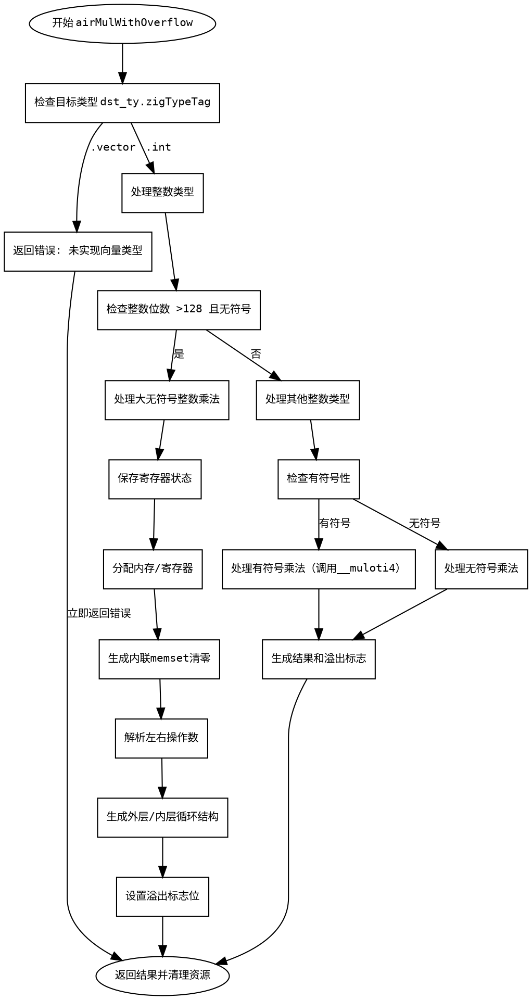

好的，我需要为提供的Zig函数`airMulWithOverflow`生成一个Graphviz的流程图。首先，我需要理解这个函数的结构和逻辑。

首先，函数`airMulWithOverflow`处理乘法操作并检查溢出。代码中有多个条件分支，比如处理向量类型、大整数、有符号和无符号的情况等。我需要将这些逻辑分解成不同的节点，并用箭头表示控制流。

步骤分解：

1. **函数入口**：开始于函数定义，处理参数和解包数据。
2. **类型检查**：根据`dst_ty`的类型标签（如`.vector`、`.int`）进行分支。
3. **处理`.vector`类型**：直接返回错误，因为未实现。
4. **处理`.int`类型**：
   - 检查整数位数是否大于128且无符号，处理大整数乘法。
   - 其他情况（如有符号、小整数）使用不同的方法处理溢出。
5. **子分支**：
   - 当处理大整数时，有多个步骤：分配寄存器、生成内联memset、处理操作数、循环结构等。
   - 对于有符号和无符号的不同处理，调用不同的汇编指令。
6. **结果处理**：将结果存储到目标位置，设置溢出标志。
7. **函数退出**：返回结果，清理资源。

需要注意循环结构（如`outer_loop`和`inner_loop`）以及条件跳转（`Jcc`指令）。这些需要用条件节点和箭头表示。

可能的节点包括：
- 开始节点
- 类型判断分支
- 处理大整数分支
- 处理有符号/无符号分支
- 生成汇编指令块
- 循环结构
- 设置结果和溢出标志
- 错误处理节点
- 结束节点

需要确保每个条件分支都有正确的连接，特别是循环和条件跳转的位置。此外，函数中的异常处理（如`self.fail`）也需要作为终止节点。

现在，根据这些步骤，构建Graphviz的流程图。使用不同的形状表示不同的节点类型，如菱形表示条件判断，矩形表示处理步骤，椭圆形表示开始和结束。
================================================
