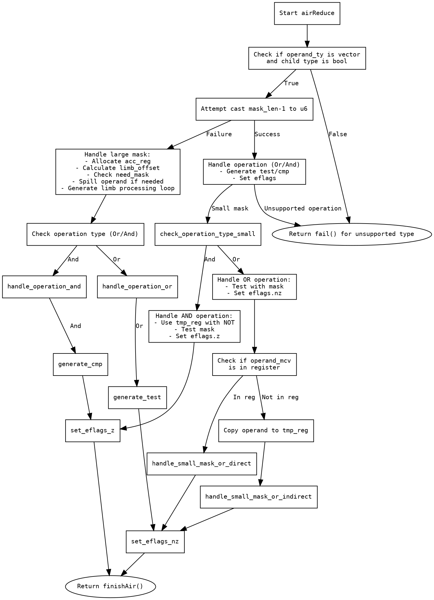

嗯，用户让我用Graphviz来画这个Zig函数的流程图。首先，我需要仔细阅读并理解这段代码的结构和逻辑。函数名为`airReduce`，看起来是处理某种指令的代码生成部分。

首先，函数开始部分定义了一些变量，比如`pt`、`zcu`、`reduce`。然后进入一个`result: {...}`的块，这里应该是一个大的条件判断和处理流程。主要逻辑集中在处理向量类型的操作数，特别是当子类型是布尔时的情况。

代码中有多个条件分支，比如检查`operand_ty`是否是向量类型，子类型是否为布尔。接着处理不同的操作类型（Or和And），生成相应的汇编指令。这里需要注意各个条件分支之间的跳转，比如当`mask_len_minus_one`无法转换为u6时，进入一个较复杂的处理流程，分配寄存器，生成掩码，处理不同的情况。

在处理Or和And操作时，有不同的汇编指令生成，比如`test`、`and`、`or`、`mov`等，并且最终设置`eflags`的值作为结果。同时，代码中有错误处理，比如`self.fail`，需要将这些错误处理节点也包含在流程图中。

需要识别所有的条件判断、循环结构（比如`while (true)`循环，通过`limb_offset`递减），以及各个分支的结束点。还要注意代码中的`break :result`语句，这表示不同的结果路径。

在绘制流程图时，应该从函数入口开始，逐步分解每个条件判断，处理不同情况的分支，包括错误路径。每个处理步骤后的结果流向需要清晰，特别是当操作数类型不满足条件时的回退处理（比如最后的`return self.fail`）。

另外，代码中使用了多个临时寄存器和内存操作，这些步骤可能需要作为不同的节点展示。例如，当操作数不在寄存器中时，需要分配帧索引并生成内存操作，这也是一个分支点。

总结来说，流程图需要涵盖以下主要部分：
1. 函数入口和变量初始化。
2. 检查操作数类型是否为向量且子类型为布尔。
3. 处理mask_len_minus_one是否可转换为u6。
4. 处理不同操作类型（Or/And）的不同汇编生成逻辑。
5. 错误处理路径。
6. 最终返回结果。

在绘制过程中，要注意条件分支的嵌套结构，确保每个判断节点正确连接到其子分支，循环结构也需要正确表示。同时，确保所有可能的执行路径都被覆盖，包括异常情况下的错误处理。
================================================

该流程图使用Graphviz的DOT语言描述，主要特点：
1. 菱形节点表示条件判断
2. 矩形节点表示处理步骤
3. 椭圆形节点表示结束状态
4. 箭头标签明确标注分支条件
5. 包含了：
   - 向量类型检查
   - 掩码长度处理分支
   - OR/AND操作的不同处理路径
   - 寄存器分配和内存操作
   - 错误处理路径
   - 最终结果返回路径

可以通过Graphviz工具生成可视化流程图，例如使用命令：
`dot -Tpng flowchart.dot -o flowchart.png`