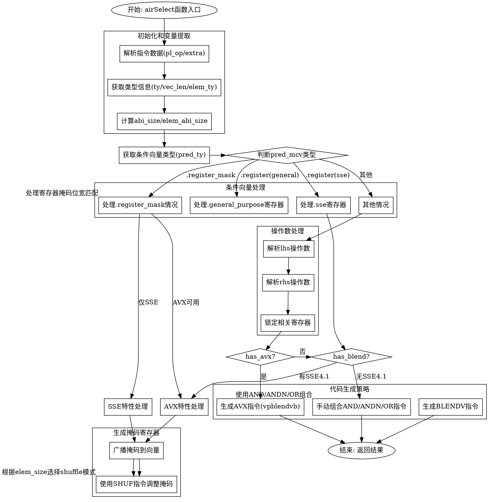

好的，我需要帮助用户生成一个函数`airSelect`的流程图，使用Graphviz的DOT语言。用户提供的代码是Zig语言编写的，看起来涉及处理向量选择和条件混合操作的代码生成部分。

首先，我需要理解这个函数的大致流程。函数`airSelect`处理一个选择指令，根据条件向量（predicate）从两个输入向量中选择元素。这可能涉及到不同的硬件特性（如SSE4.1、AVX等），不同的寄存器分配和指令生成策略。

接下来，我需要将代码分解成主要的步骤和条件分支。例如：

1. **初始化和变量提取**：获取指令的数据，类型信息，向量长度，元素类型等。
2. **处理不同的条件向量（predicate）情况**：
   - 寄存器类型的条件（通用寄存器或SSE寄存器）
   - 寄存器掩码的情况（处理不同的位宽和特性）
3. **生成掩码寄存器**：可能需要将条件向量移动到特定寄存器（如XMM0）或复制到临时寄存器。
4. **处理左右操作数（lhs和rhs）**：锁寄存器，解析操作数到MCValue。
5. **根据硬件特性选择不同的指令路径**：例如，是否有AVX、SSE4.1支持，决定使用blendv指令还是其他逻辑操作（AND、ANDN、OR组合）。
6. **生成具体的汇编指令**：根据不同的情况生成不同的指令，如vpblendvb、blendvps等，或者手动组合逻辑操作。
7. **返回结果**：将结果写入目标寄存器，解锁寄存器，完成指令生成。

在绘制流程图时，需要注意条件分支的结构，例如判断`has_avx`、`has_blend`、`pred_mcv`的类型等。每个条件分支下可能有不同的处理步骤，比如寄存器分配、指令选择等。

需要注意的复杂点包括：
- 多层嵌套的条件判断，例如处理`.register_mask`情况时内部的多个条件。
- 寄存器的锁定和解锁管理，这可能影响流程图的步骤顺序。
- 不同硬件特性导致的指令路径差异，需要正确反映在流程图中。

可能的节点包括：
- 开始节点（函数入口）
- 变量初始化和类型检查
- 条件判断（如pred_mcv的类型、硬件特性检查）
- 寄存器分配和移动
- 生成汇编指令的不同路径
- 结束节点（返回结果）

边需要连接这些节点，根据条件判断的结果导向不同的处理路径。例如，如果`has_avx`为真，则进入AVX指令生成路径，否则检查是否有SSE4.1支持等。

需要确保流程图的每个决策点清晰，处理步骤详细但不过于复杂，避免遗漏重要的分支。同时，要正确反映代码中的控制流，比如循环、条件嵌套等结构。

最后，用DOT语法将这些节点和边表示出来，使用合适的形状（如菱形表示条件判断，矩形表示处理步骤，椭圆形开始结束）。
================================================
