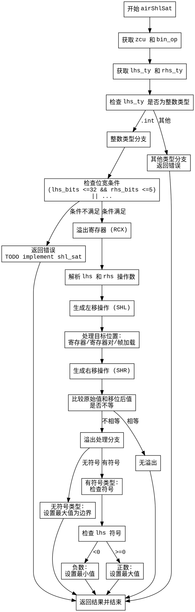

好的，我需要为给定的Zig函数`airShlSat`生成一个Graphviz的流程图。首先，我需要理解这个函数的结构和逻辑流程。

首先，函数开始于定义`zcu`和`bin_op`，然后获取`lhs_ty`和`rhs_ty`的类型。接下来，进入一个大的switch语句，处理`lhs_ty`的整数类型情况。

在整数类型分支中，首先检查左值和右值的位宽是否符合特定条件。如果不符合，返回错误。然后进行寄存器分配和溢出处理。接着，生成左移操作，并根据目标位置（寄存器、寄存器对、帧加载等）进行不同的处理，比如截断寄存器或设置内存。

之后，生成右移操作来检查是否溢出。比较原始左值和移位后的结果，如果不等则说明溢出。根据有无溢出，进入不同的分支处理：无溢出则继续，有溢出则根据有无符号类型设置最大值或最小值。

对于有符号整数，还需要检查左值的符号，如果是负数则设置最小值，正数则设置最大值。这部分涉及到条件跳转和多个基本块。

最后，函数返回结果并结束。

接下来，我需要将这些步骤转化为流程图中的节点和边。每个主要操作（如条件检查、寄存器分配、移位操作、溢出检查、符号处理等）应作为节点，条件分支作为决策节点，边表示控制流。

需要注意的是，Graphviz使用DOT语言，所以需要正确使用节点和边的语法，确保逻辑正确，避免循环或断开的部分。同时，要处理嵌套的条件结构，如内部的switch和if-else。

可能遇到的挑战是正确表示复杂的控制流，尤其是多个条件跳转和基本块之间的关系。需要仔细检查每个分支的出口和入口，确保流程图准确反映代码的执行路径。
================================================
