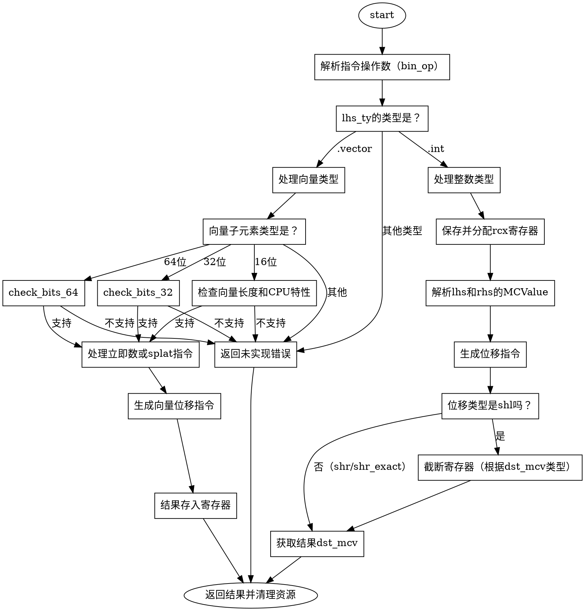

好的，我现在需要为给定的Zig函数`airShlShrBinOp`生成一个Graphviz的流程图。首先，我需要理解这个函数的结构和逻辑流程，这样才能准确地绘制出各个步骤和条件分支。

首先，函数的大致结构是这样的：它处理位移操作（如左移、右移等），根据不同的类型（整数、向量等）和不同的条件（如是否支持某些CPU特性）生成相应的机器码。函数开始部分获取一些上下文信息，比如操作数类型，然后根据类型进入不同的处理分支。

让我逐步分析函数的流程：

1. **函数开始**：获取`pt`（可能是指针类型相关的上下文）、`zcu`、`bin_op`（二进制操作数）等。
2. **确定操作类型**：根据`tag`（操作类型，如`.shr`, `.shl`等）和操作数的类型（`lhs_ty`和`rhs_ty`）进行处理。
3. **处理整数类型**：当左操作数是整数时：
   - 保存寄存器状态，分配`rcx`寄存器。
   - 解析左右操作数的值。
   - 生成位移操作，并根据是否是左移（`.shl`）进行截断处理。
   - 处理不同的存储位置（寄存器、寄存器对、帧地址等）。
4. **处理向量类型**：当左操作数是向量时，进一步根据子元素类型（如16位、32位、64位整数）和向量长度进行处理：
   - 检查支持的CPU特性（如AVX、AVX2）。
   - 处理立即数或通过指令生成的移位值。
   - 生成相应的向量位移指令。
5. **其他类型处理**：如果类型不符合上述情况，返回错误。
6. **结束处理**：返回结果并清理资源。

接下来，我需要将这些步骤转化为流程图中的节点和条件分支。注意，流程图中需要包含开始和结束节点，条件判断（如switch语句中的不同情况），以及各个处理步骤。

可能的节点和分支包括：
- 开始节点：函数入口。
- 检查`lhs_ty`的类型是否为整数或向量。
- 对于整数类型，处理不同的位移操作，并处理不同的存储情况。
- 对于向量类型，进一步检查子元素类型、向量长度和CPU特性，生成相应的指令。
- 错误处理节点，当类型不支持时。
- 结束节点，返回结果。

需要注意的条件分支：
- `switch (lhs_ty.zigTypeTag(zcu))` 分支到整数或向量处理。
- 在向量处理中，根据子元素位数和向量长度的不同分支。
- 检查是否有特定的CPU特性（如`.avx`, `.avx2`）。
- 处理立即数或指令生成的移位值时的不同情况。

需要确保所有可能的路径都被覆盖，并且条件判断正确连接。例如，当处理`.shl`时，需要根据`dst_mcv`的类型（寄存器、寄存器对、帧地址）执行不同的截断操作。在向量处理中，不同的元素大小和向量长度会导致不同的指令生成。

此外，函数中有多处错误处理（如`try`表达式），但可能不需要在流程图中详细表示这些错误路径，除非它们是显式的条件分支。通常，流程图更关注主要的逻辑流程而非错误处理，除非错误处理是流程的重要部分。

现在，将这些分析转化为Graphviz的节点和边。使用不同的形状表示不同节点类型，如矩形表示处理步骤，菱形表示条件判断，椭圆形表示开始和结束。

可能的Graphviz结构：

```
digraph {
    node [shape=ellipse]; start end;
    node [shape=diamond]; condition1 condition2 ...;
    node [shape=rectangle]; process1 process2 ...;

    start -> condition1;
    condition1 [label="lhs_ty是整数吗？"];
    condition1 -> process_int [label="是"];
    condition1 -> condition_vector [label="否"];

    process_int -> process_shl_shift;
    process_shl_shift -> check_dst_mcv_type;
    check_dst_mcv_type -> case_register;
    check_dst_mcv_type -> case_register_pair;
    check_dst_mcv_type -> case_load_frame;
    ...其他处理步骤...

    condition_vector [label="lhs_ty是向量吗？"];
    condition_vector -> process_vector [label="是"];
    condition_vector -> error [label="否"];

    process_vector -> check_child_type;
    check_child_type -> case_16bit;
    check_child_type -> case_32bit;
    ...其他子元素类型处理...

    error -> end [label="返回错误"];
    ...其他连接...
    process_... -> end;
}
```

需要注意确保所有条件分支都被正确连接，并且每个处理步骤的出口指向正确的下一个节点。例如，处理完整数或向量分支后，最终都会到达结束节点，或者在无法处理时进入错误节点。

可能还需要处理向量中的多个层次的条件，如检查向量子元素的类型、长度，以及CPU特性是否存在。这些都需要在流程图中分层展示，避免过于拥挤。

最后，确保生成的流程图符合Graphviz语法，没有语法错误，并且结构清晰，易于理解。
================================================


该流程图的关键路径说明：
1. **入口**从解析操作数开始，根据左操作数类型分派到整数或向量处理
2. **整数路径**：
   - 强制占用rcx寄存器
   - 生成基础位移指令后，针对shl操作需要特殊处理寄存器截断
3. **向量路径**：
   - 根据子元素位宽分层检查（16/32/64位）
   - 结合CPU特性和向量长度选择指令
   - 处理立即数或splat形式的移位参数
4. **错误处理**贯穿始终，任何不支持的类型/操作都会跳转到错误节点
5. **结束节点**统一处理结果返回和寄存器释放

特殊形状说明：
- 椭圆：流程开始/结束
- 菱形：关键类型/条件判断
- 矩形：具体操作步骤