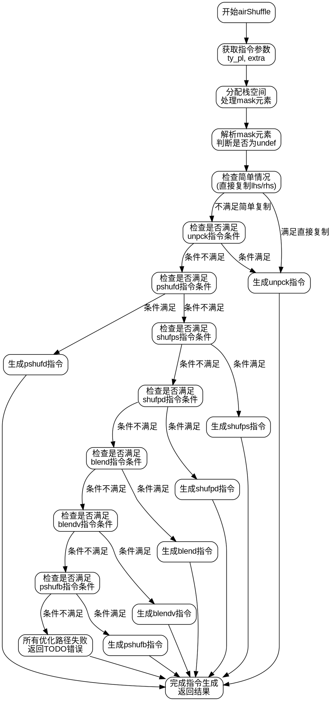

好的，我现在需要为提供的Zig函数`airShuffle`绘制一个流程图。首先，我需要理解这个函数的结构和逻辑流程。这个函数处理LLVM IR中的shuffle指令，生成相应的机器代码。看起来函数中有多个条件分支，尝试不同的指令集优化路径，如unpck、pshufd、shufps、shufpd、blend等，如果所有优化路径都不适用，则返回错误。

首先，我需要分析函数的控制流。函数开始于获取各种类型和参数，然后分配内存来处理mask元素。接着，函数进入一系列的条件检查，每个条件对应不同的指令生成策略。每个条件块（如unpck、pshufd等）都可能生成对应的机器指令，如果成功则跳转到结果，否则继续下一个条件检查。最后，如果所有条件都不满足，则返回错误。

接下来，我需要将这些条件分支转化为流程图。每个主要的条件块（例如unpck、pshufd等）应作为决策节点，根据条件是否满足进入不同的处理流程。每个处理流程最终会生成结果或继续下一个条件检查。最后，如果所有路径都失败，则进入错误处理。

需要注意，函数中有多个for循环和条件判断，这些需要被合理抽象，避免流程图过于复杂。例如，每个主要的条件块（如检查是否可以使用unpck指令）可以作为一个决策节点，然后根据结果进入不同的子流程。

此外，函数中有多个break和标签（如:result, :unpck等），这些控制流跳转需要在流程图中正确表示。例如，当某个条件满足时，使用break :result跳转到结果处理，否则继续下一个条件检查。

最后，确保流程图中的每个节点清晰标注，例如“检查是否可以使用unpck指令”、“生成unpck指令”、“检查是否可以使用pshufd指令”等，并在无法处理时进入错误节点。

可能遇到的挑战是如何将复杂的嵌套条件和循环简化为易于理解的流程图节点，同时保持逻辑的准确性。需要确保每个主要条件分支都被正确表示，并且流程图的路径正确反映函数的执行顺序。
================================================
