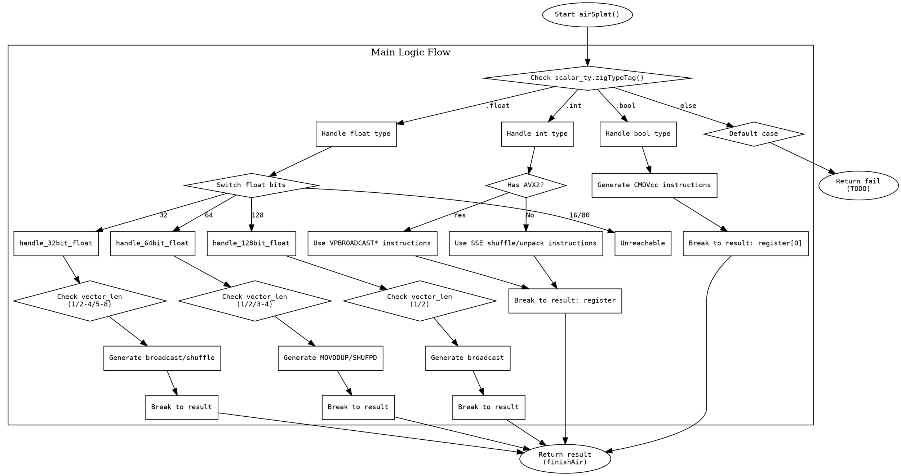

嗯，用户让我用graphviz来画这个Zig函数airSplat的流程图。首先，我需要仔细阅读代码，理解它的结构和逻辑分支。

这个函数的主要逻辑是根据不同的标量类型（scalar_ty）生成不同的机器代码。首先，函数处理布尔类型，然后是整数类型，接着是浮点数类型。每种类型下又有不同的情况，比如整数类型根据位宽和向量长度选择不同的指令，浮点数根据位数和向量长度处理不同的情况。

接下来，我需要确定每个条件分支和循环结构。例如，代码中有多个switch语句，处理不同类型的scalar_ty，比如.bool、.int、.float等。每个case内部又有嵌套的条件判断，比如根据vector_len的不同值来选择不同的指令或处理方式。

然后，我需要将这些逻辑结构转化为graphviz的节点和边。每个条件判断对应一个菱形节点，不同的分支对应不同的处理流程。处理步骤用矩形节点表示，流程结束用椭圆形节点。

需要注意的是，代码中有多个return和break语句，这些会影响流程的走向。例如，当处理完某个case后，会break到result标签，然后返回结果。此外，错误处理部分如return self.fail也需要体现在流程图中。

还要注意代码中的循环结构，比如defer语句中的循环解锁寄存器，虽然这在流程图中可能不需要特别表示，因为它属于资源管理，不影响主要逻辑流程。

最后，确保所有的分支都被覆盖，没有遗漏的条件判断，并且流程图的箭头正确指向下一个节点。可能需要多次检查代码，确保每个可能的执行路径都有对应的节点和边。
================================================
