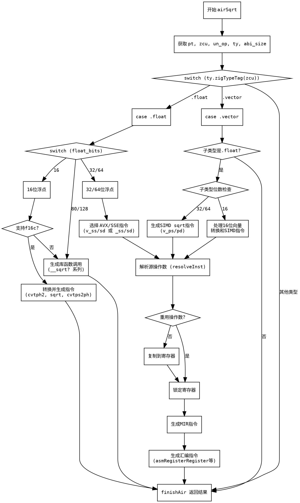

好的，我现在要尝试理解用户提供的这个Zig函数`airSqrt`，并根据其逻辑绘制出流程图。首先，我需要通读代码，了解每个部分的功能，然后确定各个条件分支和循环结构，最后将这些部分组织成一个流程图。

首先，函数`airSqrt`似乎是处理平方根生成的代码生成部分。函数开始部分获取了一些上下文信息，比如类型、操作数等。接着进入一个大的switch语句，根据类型标签（`ty.zigTypeTag(zcu)`）处理不同的情况，主要是浮点数和向量类型。

对于浮点类型（`.float`），代码检查浮点数的位数（16、32、64等），并根据目标平台是否支持特定的指令集（如f16c、avx）来决定生成哪种机器指令。例如，16位浮点数需要检查是否支持f16c，如果支持，则进行转换和平方根计算；否则可能调用库函数。对于32位和64位浮点数，则直接生成相应的SSE或AVX指令。

接下来是向量类型的处理。这里同样检查子元素的类型和向量长度，选择不同的指令。例如，对于包含16位浮点数的向量，可能需要先转换为32位浮点数进行计算，然后再转换回来。对于不同长度的向量，选择不同的SIMD指令（如v_ps、v_pd等）。

在代码中，有很多条件判断，比如`switch (float_bits)`、`switch (ty.vectorLen(zcu))`等，这些都会影响生成的指令路径。此外，还有寄存器管理和复制的逻辑，比如`copyToRegisterWithInstTracking`和`lockReg`，这些在流程图中可能需要表示为不同的步骤或状态。

需要注意的是，代码中有多个`break :result`语句，这表示在不同的条件下提前退出并返回结果。流程图中需要正确表示这些提前退出的分支。

现在，我需要将这些逻辑步骤转化为Graphviz的流程图。每个主要条件判断（如switch语句）会成为流程图中的一个决策节点，不同的分支对应不同的处理路径。对于每个处理路径，需要画出相应的操作步骤，如调用函数、生成指令、寄存器操作等。

可能的结构如下：

1. 函数入口，处理初始设置（获取pt, zcu, un_op, ty, abi_size）。
2. 进入大的switch，根据类型标签分为`.float`和其他。
3. 对于`.float`类型，检查浮点位数：
   - 16位：检查f16c支持，若支持则进行转换和计算；否则调用库函数。
   - 32/64位：生成对应的SSE/AVX指令。
   - 其他位数（如80、128）可能直接调用库函数。
4. 对于向量类型，检查子类型和长度，生成相应的SIMD指令。
5. 处理寄存器分配和复制，确保操作数在正确的寄存器中。
6. 生成最终的机器指令（如asmRegisterRegister等）。
7. 返回结果。

需要特别注意条件判断之间的嵌套关系，例如在向量处理中，又分为不同的子元素类型和向量长度，这可能需要多层次的决策节点。

另外，代码中有一些错误处理（如`try`和`orelse return self.fail`），这些在流程图中可能需要表示为失败路径或异常退出。

最后，将所有这些步骤用Graphviz的节点和边连接起来，确保逻辑正确，路径清晰。
================================================
