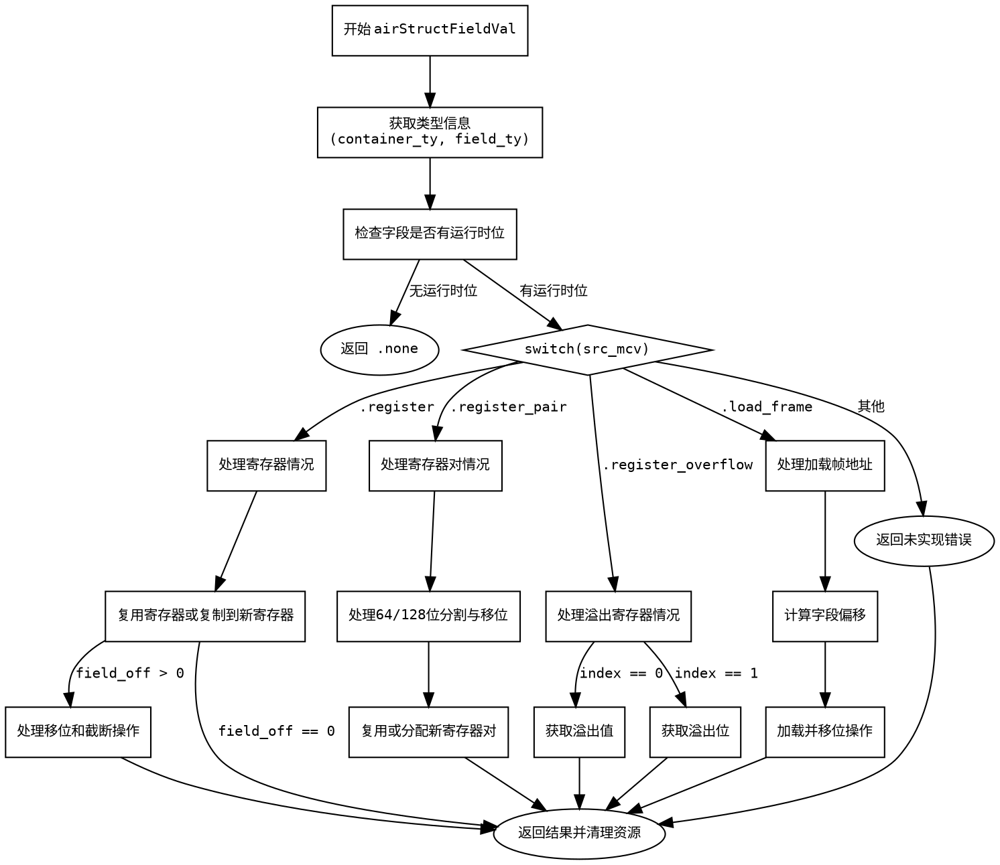

嗯，我需要为提供的Zig函数`airStructFieldVal`绘制一个流程图。首先，我得仔细理解这个函数的结构和逻辑流程。这个函数的主要功能是处理结构体字段的取值，根据不同的输入情况生成相应的机器码值（MCValue）。看起来函数内部有很多分支，处理不同的`src_mcv`情况，比如寄存器、寄存器对、溢出寄存器、加载帧地址等。

首先，我需要确定函数的主要分支。函数开始时会获取一些类型和字段的信息，然后根据`src_mcv`的不同类型进入不同的处理分支。每个分支内部又有条件判断和不同的操作，比如复制寄存器、生成移位指令、截断寄存器等。

接下来，我需要将这些分支结构转化为流程图。可能的步骤包括：

1. **函数入口**：开始处理`airStructFieldVal`。
2. **获取类型和字段信息**：计算`container_ty`、`field_ty`等。
3. **检查字段是否有运行时位**：如果没有，直接返回`.none`。
4. **处理不同的`src_mcv`情况**：
   - **寄存器**：处理单个寄存器的情况，可能涉及移位和截断。
   - **寄存器对**：处理两个寄存器的情况，可能需要分配新寄存器或复用。
   - **寄存器溢出**：处理溢出情况，分为获取值或溢出位。
   - **加载帧地址**：处理从帧地址加载的情况，可能需要处理不同的偏移和位操作。
   - **其他情况**：返回未实现的错误。
5. **结束处理**：返回结果并清理资源。

在绘制流程图时，需要注意每个条件判断的分支，比如`switch (src_mcv)`的不同case，以及每个case内部的条件处理，比如`field_off`是否为0，是否复用操作数等。此外，还要注意资源管理，比如锁寄存器和解锁寄存器的操作，但这些可能在流程图中以步骤表示，而不是详细的锁管理。

需要确保每个分支都有正确的连接，避免遗漏任何可能的路径。可能遇到的挑战是处理复杂的嵌套条件，比如在寄存器对处理中，还有进一步的子条件判断。这时候需要将这些子条件拆分成不同的节点，保持流程图的清晰。

最后，使用Graphviz的DOT语言来编写流程图，定义各个节点和它们之间的连接关系。每个主要步骤作为一个节点，条件判断作为菱形节点，分支箭头标明条件结果。
================================================
