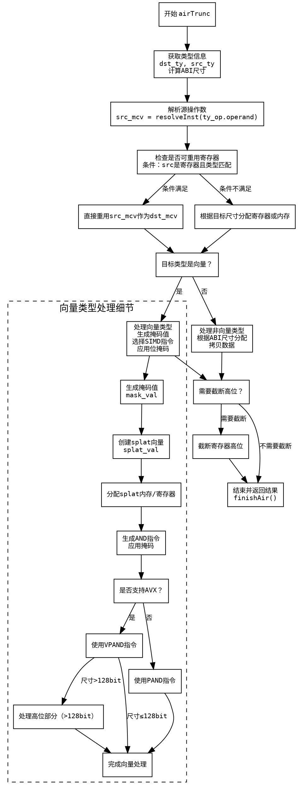

嗯，我需要为这个Zig函数`airTrunc`绘制流程图。首先，我得仔细阅读代码，理解它的逻辑结构。函数`airTrunc`处理的是截断操作，可能是将较大的数据类型转换为较小的，比如整数或向量的截断。

首先，函数开始部分获取了一些类型和操作数的信息，比如`dst_ty`（目标类型）和`src_ty`（源类型），以及它们的ABI大小。接着，处理结果部分分为不同的情况：

1. **处理源操作数**：通过`resolveInst`获取源操作数的MCValue（可能是一个寄存器或内存位置），并根据是否可重用寄存器来决定是否需要复制到目标寄存器。
2. **目标类型是向量**的情况：这里涉及到向量元素的处理，生成相应的机器指令，比如AVX指令。需要检查目标元素的大小和源元素的大小，选择合适的指令（如vp_b, ackusw等）。这里还涉及到掩码的生成和应用，以及对寄存器的操作。
3. **处理非向量类型**：根据目标ABI大小（<=8或<=16），决定如何分配寄存器和处理截断。例如，对于超过8字节的情况，可能需要分配两个寄存器作为寄存器对，并进行相应的数据拷贝。
4. **截断后的额外处理**：如果目标类型不是2的幂次方大小，需要截断高位多余的位。这部分可能涉及到对寄存器的额外操作，比如使用掩码或移位指令。

整个流程中，存在多个条件分支，比如判断目标类型是否为向量、ABI大小是否超过某个阈值、是否支持特定的CPU特性（如AVX、SSE4.1等）。这些条件分支会导致不同的处理路径。

接下来，我需要将这些逻辑步骤转化为流程图。流程图应包含开始节点、结束节点、各个条件判断（菱形框）、处理步骤（矩形框）以及箭头表示流程方向。需要注意的是，代码中存在多个嵌套的条件和循环结构（例如，处理向量时的多个switch和if判断），需要正确表示这些分支。

可能的流程节点包括：
- 开始
- 获取类型和操作数信息
- 判断目标类型是否为向量
- 处理向量类型（包括掩码生成、指令选择等）
- 处理非向量类型（根据ABI大小分配寄存器）
- 截断多余的高位
- 结束并返回结果

需要特别注意错误处理的情况，例如`self.fail`的返回路径，但可能这些属于异常流程，在正常流程图中可以省略，或者用单独的分支表示。

在绘制时，可能会遇到复杂的嵌套条件，需要合理拆分，避免流程图过于混乱。例如，处理向量类型时的多个switch条件可以合并为一个判断步骤，再根据不同的条件分支到不同的处理块。

最后，确保流程图的每个步骤都对应代码中的关键操作，并且逻辑顺序正确。
================================================
