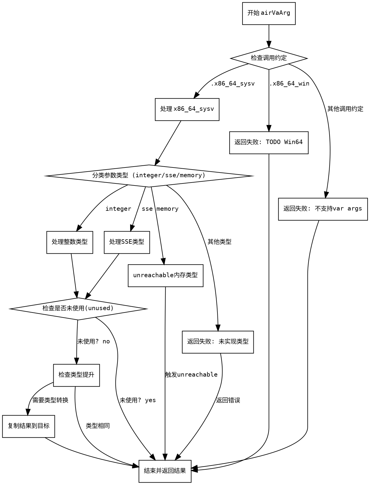

好的，我需要为提供的Zig函数`airVaArg`生成一个Graphviz的流程图。首先，我需要理解这个函数的结构和逻辑流程。

首先，函数开始于`fn airVaArg`的定义，然后处理不同的调用约定，特别是`.x86_64_sysv`和`.x86_64_win`，以及其他情况。对于SysV调用约定，函数内部有多个分支，根据参数类型（如整数类、SSE类、内存类）进行不同的处理。每个分支中有条件判断、寄存器分配、内存操作等步骤。

流程图需要涵盖函数的主要流程：
1. 函数入口。
2. 处理不同的调用约定，分为SysV、Win64和其他。
3. 对于SysV情况，进一步根据参数类型（integer、sse、memory等）分支。
4. 每个参数类型分支中的具体步骤，如寄存器分配、条件判断、内存操作等。
5. 处理完后的结果返回。

需要注意错误处理和未实现的情况，比如`unreachable`和`fail`的情况。此外，需要处理`unused`变量是否影响流程。

接下来，我需要将上述逻辑转化为Graphviz的节点和边。每个主要步骤作为节点，条件判断作为分支边。例如，调用约定判断后的分支，参数类型判断后的分支，以及每个处理步骤的顺序。

可能需要使用子图来组织不同调用约定下的处理流程。但由于Graphviz的子图处理可能复杂，可能更简单的方式是使用节点和条件分支线来表示。

此外，需要注意循环和跳转，例如`performReloc`和`asmJmpReloc`可能涉及跳转标签，但在这个函数中可能通过基本块的方式处理，可能需要用节点之间的箭头表示控制流。

需要确保所有可能的路径都被覆盖，包括错误路径和未实现的情况。例如，当遇到`.x86_64_win`时，返回失败；遇到其他调用约定时也返回失败。

最后，生成Graphviz代码，使用正确的语法，如`digraph`，节点用方框，条件判断用菱形，边用箭头表示流程方向，并标注条件（如调用约定类型、参数类型等）。
================================================
