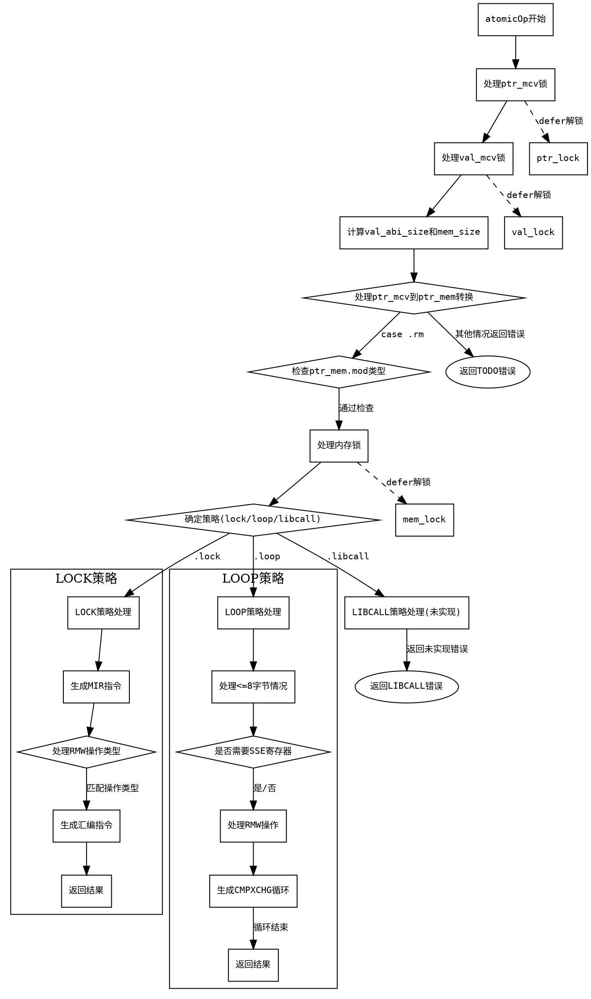

好的，我现在需要帮用户用Graphviz画出给定Zig函数的流程图。首先，我需要仔细阅读这个函数，理解它的结构和逻辑流程。这个函数是atomicOp，看起来是处理原子操作的代码生成部分。

首先，我会通读整个函数，看看主要的控制流。函数开始处理ptr_mcv和val_mcv的锁，然后根据不同的情况生成不同的内存操作。接着，根据不同的策略（strat）选择.lock、.loop或.libcall三种处理方式。每个策略下有不同的代码分支，比如.lock策略下生成不同的MIR指令，.loop策略处理不同大小的操作，可能还有循环结构，而.libcall则未实现，返回错误。

接下来，我需要确定各个条件分支和循环的位置。例如，函数一开始处理ptr_mcv和val_mcv的锁，然后计算val_abi_size，确定mem_size，处理ptr_mem的不同情况。然后根据use_sse和strat的不同进入不同的处理分支。在.lock策略中，根据不同的rmw_op生成不同的mir_tag，操作寄存器，生成汇编指令。在.loop策略中，分为val_abi_size小于等于8和更大的情况，处理SSE寄存器、临时寄存器，生成循环结构，使用cmpxchg指令，并根据条件跳转。对于更大的尺寸（如16字节），可能分高低位处理，使用多个寄存器，如rax、rdx、rbx、rcx等，并进行循环比较和交换。最后的.libcall分支直接返回错误。

在绘制流程图时，需要将每个主要步骤作为节点，条件判断作为分支节点，循环结构用箭头连接形成环路。例如，处理ptr_mem的switch语句可能导致不同的路径，strat的选择决定三个主要分支。每个分支内部又有子条件，如不同的rmw_op对应不同的操作，生成不同的汇编指令。对于循环，需要标注循环开始和结束的位置，如loop标签处的跳转。

需要注意的是，函数中有多个defer语句，用于释放锁，这在流程图中可能需要表示为资源管理步骤，但可能不需要特别突出，除非对流程有影响。另外，错误处理如返回fail的情况也应作为终止节点。

最后，确保流程图的结构清晰，每个条件分支和循环正确表示，节点之间的箭头准确反映代码的执行顺序。可能需要分层次处理，主流程分为几个大块，每个大块内部细化。例如，主流程分为初始化、选择strat策略、处理不同策略，每个策略内部的具体步骤分解成子节点。

现在，根据这些分析，我可以开始构建Graphviz的节点和边，确保每个判断和操作都被正确表示，并保持流程图的逻辑连贯性。
================================================
