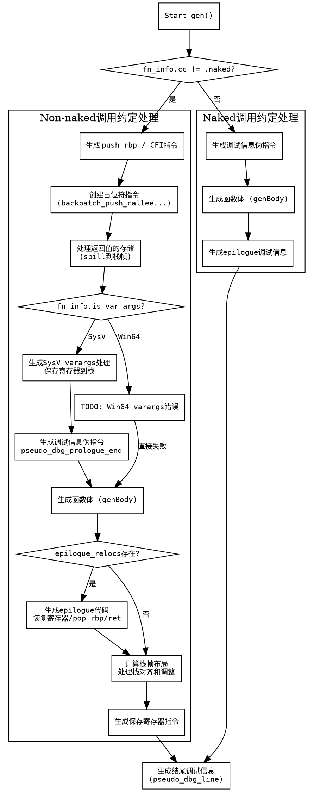

好的，我需要帮用户将提供的 Zig 代码中的 `gen` 函数转换为 Graphviz 的流程图。首先，我需要理解这段代码的结构和逻辑。

首先，我注意到函数开始处有一些条件判断，比如 `if (fn_info.cc != .naked)`，这会影响后续的代码执行路径。接着，在非 naked 调用约定下，有很多关于栈帧设置、保存寄存器、处理可变参数等操作。之后，处理函数体（`genBody`）和生成 epilogue 的部分，包括可能的堆栈调整和寄存器恢复。最后，无论是否 naked，都有处理调试信息的代码。

接下来，我需要将这些逻辑步骤分解成流程图中的节点。每个主要条件判断会生成分支，比如 `fn_info.cc != .naked` 分为两个分支。然后，每个分支内的操作步骤需要作为节点连接起来。需要注意的是，有些部分可能包含循环或嵌套条件，比如处理可变参数时的循环保存寄存器，或者根据不同的堆栈调整策略生成不同的指令。

需要注意的是，代码中有多个占位符（`backpatch_push_callee_preserved_regs` 等），这些可能在后续被替换为具体指令。但在流程图中，可能只需要表示这些步骤的存在，而无需详细展开。

另外，`genBody` 函数调用是处理函数体的主逻辑，可能需要将其视为一个单独的过程块。然后，根据是否有 `epilogue_relocs` 来决定是否生成 epilogue 的代码块。

最后，流程图的结束部分是关于调试信息的处理，无论前面的路径如何，这部分都会执行。

现在，我需要将这些步骤结构化，使用 Graphviz 的 DOT 语言来表示节点和边。每个条件判断作为菱形节点，操作步骤作为矩形节点，流程箭头表示执行顺序。需要注意循环和条件分支的正确连接，确保流程图的准确性。
================================================
