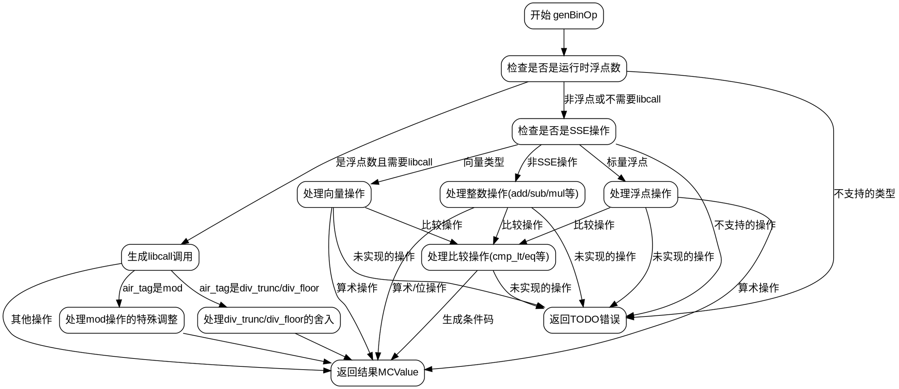

嗯，我需要为提供的Zig函数`genBinOp`生成一个Graphviz的流程图。首先，我得仔细看看这个函数的结构，理解它的逻辑流程。

函数`genBinOp`处理二进制操作，根据不同的类型和操作生成相应的机器码。看起来有很多条件分支，处理不同的数据类型（比如浮点数、整数、向量）和不同的操作符（比如加法、减法、比较等）。

首先，我需要确定函数的主要分支点。例如，函数开始时检查是否是浮点运算，可能需要调用库函数。然后根据不同的`air_tag`（操作类型）进行处理。接着，处理SSE指令的情况，以及整数运算的情况，可能还有向量操作的处理。

接下来，我需要将这些条件分支和循环转化为流程图中的节点和边。每个条件判断（如`if`语句、`switch`语句）会成为决策节点，不同的处理路径成为分支。

需要注意，函数中有多个嵌套的条件判断，比如检查`lhs_ty`的类型，不同的`air_tag`，是否有特定的CPU特性支持（如`.avx`、`.sse4_1`等）。这些都需要在流程图中体现出来。

可能的结构：
1. 开始节点：函数入口。
2. 检查是否是浮点运算，需要调用libcall。
3. 根据不同的`air_tag`生成不同的libcall。
4. 处理`mod`操作的特殊情况，可能需要额外的调整。
5. 处理非浮点情况，检查是否是SSE操作。
6. 根据不同的类型（整数、向量）和操作符生成不同的机器指令。
7. 处理比较操作，生成条件码。
8. 返回结果。

在绘制流程图时，需要将每个主要步骤作为节点，条件判断作为菱形节点，分支箭头标明条件结果。对于复杂的嵌套条件，可能需要分层处理，避免图表过于复杂。

另外，注意函数中有很多错误处理（如`return self.fail(...)`），这些可以作为终止节点。

可能需要将大函数分解为子流程，比如处理浮点运算、处理整数运算、处理向量运算等，每个部分作为子图，以提高可读性。

最后，确保流程图的箭头正确反映了函数的控制流，包括循环和条件分支的正确流向。
================================================
