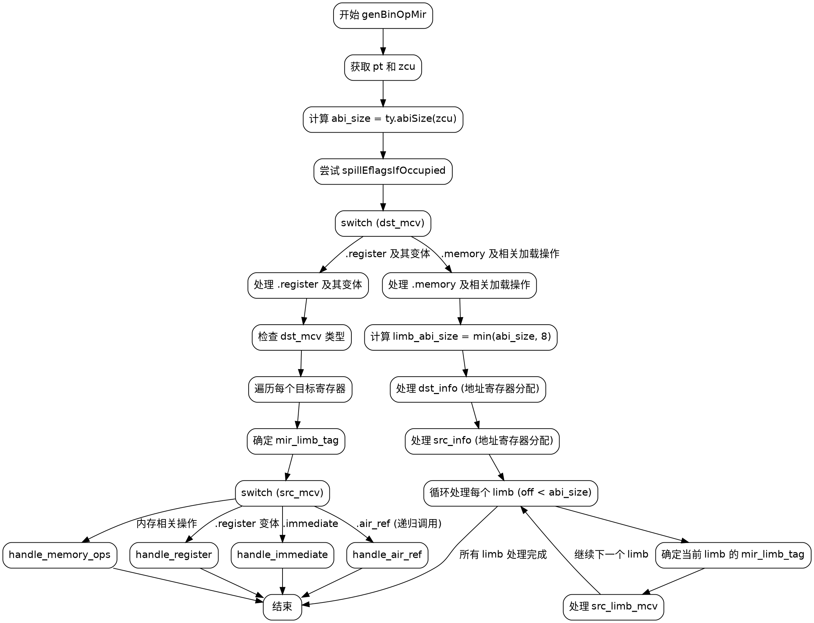

好的，我需要为给定的Zig函数`genBinOpMir`绘制一个流程图。首先，我要理解这个函数的结构和逻辑流程。

函数开始于参数声明，然后获取`pt`和`zcu`，计算`abi_size`，并尝试溢出eflags。接下来是一个大的switch语句，处理`dst_mcv`的不同情况。主要的case是`.register`及其变体，以及`.memory`和相关的加载操作。

对于`.register`的情况，函数遍历每个目标寄存器，处理不同的`mir_limb_tag`，并根据`src_mcv`的类型生成相应的汇编指令。这里有很多分支，比如处理立即数、寄存器、内存地址等。

然后是处理`.memory`和间接加载的情况，这里涉及到计算地址、分配寄存器、处理不同的加载类型，以及循环处理每个limb（部分数据块）。

我需要将整个函数的控制流分解成主要的步骤和决策点。可能的节点包括开始、结束、各个switch case、循环、错误处理等。连接这些节点的边表示控制流的转移，如条件判断、循环迭代、函数返回等。

需要注意错误处理和递归调用的情况，例如在`src_mcv`为`.air_ref`时，函数会递归调用自身。此外，一些路径可能会导致`unreachable`，这些也需要在流程图中体现。

由于代码中存在多个嵌套的switch和循环，我需要分层表示，确保每个分支和循环都清晰可见。可能需要使用子图来处理复杂的部分，比如处理不同`dst_mcv`类型时的不同逻辑。

最后，确保流程图符合Graphviz的语法，正确使用节点、边、标签，以及合适的结构来表示代码的逻辑流程。
================================================
