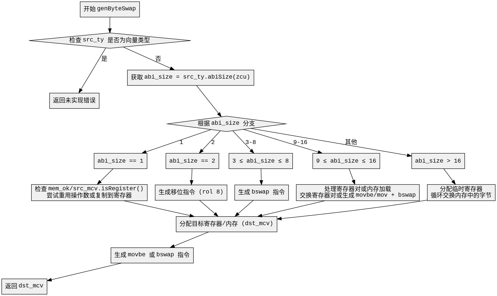

好的，我现在需要为给定的Zig函数genByteSwap生成一个Graphviz流程图。首先，我需要仔细阅读代码，理解其逻辑结构，然后将其分解为不同的节点和决策点，最后用Graphviz的DOT语言表示出来。

首先，函数genByteSwap的参数包括self、inst、src_ty、src_mcv和mem_ok。它的主要功能是根据不同的条件生成字节交换的机器码值（MCValue）。我需要理清代码中的各个条件分支。

函数开始时检查src_ty是否为向量类型，如果是，则返回未实现的错误。这部分可以作为一个条件判断节点。

接下来，处理不同abi_size的情况。abi_size是src_ty的ABI大小，根据不同的值（0、1、2、3-8、9-16、其他）有不同的处理逻辑。每个case分支需要转化为不同的流程节点。例如，当abi_size为1时，会尝试重用操作数或复制到寄存器；当为2时，生成移位指令；3-8时使用bswap指令；9-16时处理更复杂的寄存器对或内存操作；更大的尺寸则使用循环交换字节。

对于每个case，需要进一步分析内部的逻辑。例如，在abi_size为9-16的情况下，可能存在将寄存器内容存入栈帧，然后加载回来处理，或者处理寄存器对的情况。这里会有多个子步骤，如分配寄存器、生成汇编指令等。

较大的abi_size（超过16的情况）会进入一个循环结构，使用临时寄存器进行字节交换。这部分需要处理循环的初始化、循环体以及循环条件判断。例如，使用xor清零寄存器，设置计数器，然后在循环中交换内存中的数据，直到满足条件退出循环。

最后，函数处理dst_mcv的分配，根据条件选择分配寄存器或内存位置，并生成相应的机器指令，如movbe或bswap。

在绘制流程图时，需要注意条件判断的分支，如switch语句中的不同case，以及每个case内部的子条件（如src_mcv的类型是否为寄存器或寄存器对等）。每个处理步骤应作为一个节点，条件判断作为菱形节点，箭头表示流程走向。

可能遇到的挑战是正确处理嵌套的条件和循环结构，确保每个分支都被正确表示。此外，代码中存在多个返回点，需要确保流程图的终止点正确。

总结步骤：
1. 确定函数的主要结构，如初始检查、abi_size的switch分支。
2. 将每个case转化为流程图中的分支节点。
3. 处理每个case内部的逻辑，分解为更细的节点和判断。
4. 处理循环结构，正确表示循环的开始、体和结束。
5. 确保所有可能的路径都被覆盖，包括错误返回和正常返回。

现在，我需要将这些步骤转化为Graphviz的DOT语言，使用正确的节点和边连接，确保逻辑清晰。
================================================
