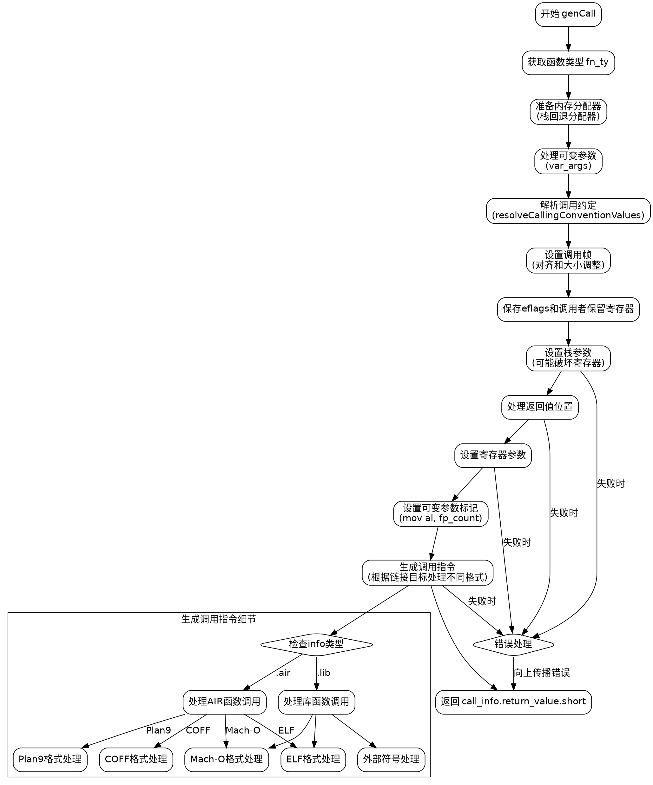

好的，我需要为提供的Zig函数`genCall`绘制一个流程图。首先，我需要仔细阅读代码，理解它的结构和各个部分的功能。

函数`genCall`接受一个联合类型的`info`参数，可能是来自AIR指令或库调用。然后处理参数类型、参数值和选项，生成机器码值。看起来主要步骤包括确定函数类型、处理参数、分配寄存器、设置调用帧、生成汇编指令等。

首先，我会将函数分解为几个主要部分：

1. **确定函数类型（fn_ty）**：根据`info`的不同情况（air或lib），获取函数类型。
2. **准备参数和内存分配**：使用栈分配器分配变量参数、帧索引和寄存器锁。
3. **处理调用约定和参数传递**：解析调用约定，分配寄存器和栈空间，处理参数传递（包括寄存器参数和栈参数）。
4. **生成汇编指令**：根据不同的情况（如外部函数调用、内部函数调用等）生成相应的汇编指令。
5. **返回结果**：返回调用后的结果值。

接下来，我需要将这些步骤转化为流程图中的节点，并确定它们之间的逻辑流向。需要注意条件分支，例如根据`info`的类型（air或lib）处理不同的调用方式，以及不同的目标文件格式（ELF、COFF、Mach-O等）生成不同的汇编指令。

在绘制流程图时，需要特别注意循环和条件判断的结构，例如处理参数时的循环，以及根据不同的调用约定和参数类型选择不同的处理路径。此外，错误处理和资源释放（如解锁寄存器）也需要在流程中体现。

可能遇到的挑战包括正确识别所有条件分支和循环结构，以及确保流程图的逻辑与代码结构一致。需要仔细检查每个switch和if语句，确定它们的分支情况，并在流程图中正确表示。

最后，确保流程图使用Graphviz的DOT语言正确描述，避免使用Mermaid语法。每个节点用方框表示，箭头表示流程方向，条件分支用菱形节点表示，并根据不同情况分支出不同的路径。
================================================
