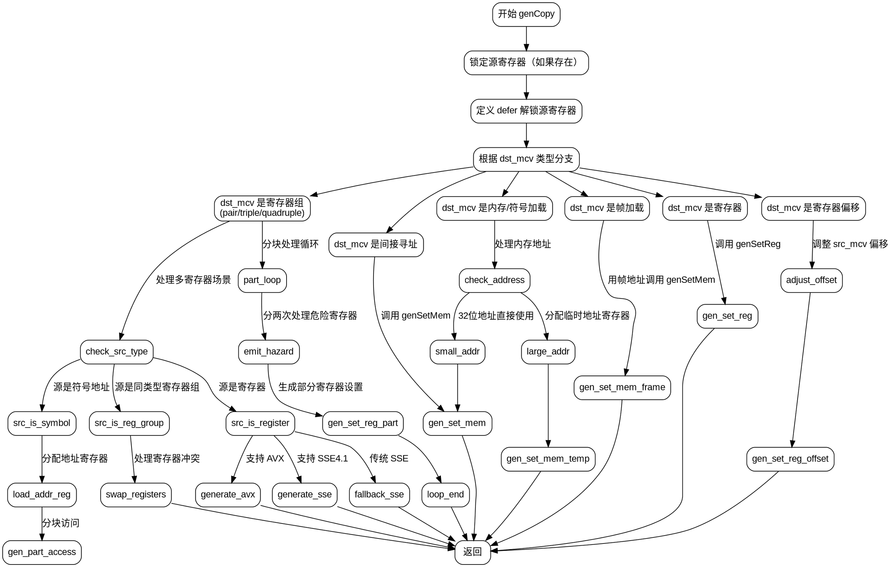

好，我需要为提供的Zig函数genCopy绘制流程图。首先，我要仔细阅读这段代码，理解它的结构。

函数开头处理了src_mcv的寄存器锁定，然后根据dst_mcv的不同情况进入不同的分支。主要的控制流在switch (dst_mcv)的分支里。

首先，对于dst_mcv的不同case，比如.register、.register_offset、inline的register组合（如pair、triple等）、.indirect、.memory、.load_frame等等，每个分支都有不同的处理逻辑。

比如，当dst_mcv是.register时，调用genSetReg；如果是.register_offset，则处理偏移并调整src_mcv的偏移量；对于inline的register组合，处理多个寄存器的情况，可能需要生成多条指令，处理数据移动和可能的寄存器冲突。

在inline分支中，还涉及到对src_mcv的不同情况处理，比如是否是寄存器、内存地址等，这里可能需要生成不同的汇编指令。特别是当src_mcv是寄存器对或者需要处理地址时，会有不同的逻辑路径。

对于.indirect的情况，调用genSetMem来处理内存写入；对于.memory或其他加载符号的情况，可能需要计算地址并调用genSetMem。

此外，在处理过程中，还需要考虑寄存器的锁定和解锁，避免资源冲突。例如，在复制到临时寄存器时，会分配并锁定寄存器，使用后解锁。

绘制流程图时，需要将每个分支结构清晰地表示出来，特别是switch语句中的各个case以及它们的子处理逻辑。同时，循环结构如for循环和while循环也需要体现在流程图中，比如在处理多个寄存器时的循环遍历。

需要注意的是，某些分支可能会提前返回，例如在处理register_pair等时，某些条件满足后直接return。这些提前退出的情况也要在流程图中标明。

最后，确保流程图覆盖所有可能的路径，包括错误处理（如errdefer）和资源释放（defer语句）。
================================================
