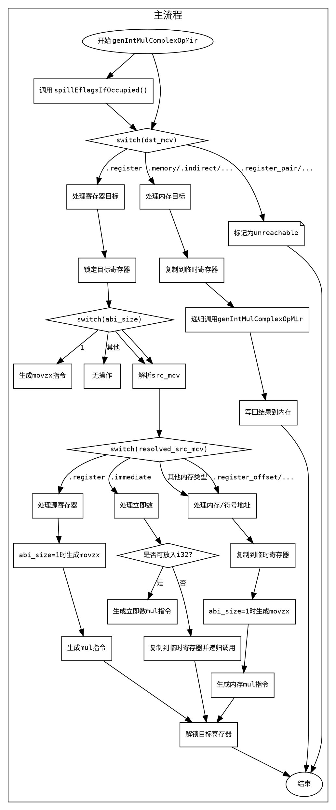

好的，我现在需要为提供的Zig函数生成一个Graphviz流程图。首先，我得仔细阅读并理解这个函数的逻辑结构。函数名为genIntMulComplexOpMir，看起来是处理整数乘法操作的代码生成部分。

首先，函数开始处定义了一些变量，如pt和abi_size，然后调用spillEflagsIfOccupied()。接下来是一个大的switch语句，根据dst_mcv的不同情况进行处理。主要的case是.register，这里处理寄存器作为目标的情况，包括锁定寄存器、处理不同大小的数据（如1字节时使用movzx扩展），然后处理源操作数src_mcv的不同情况，比如寄存器、立即数、内存地址等，分别生成相应的汇编指令。

在.register情况下，又有一个内部的switch，根据abi_size的不同处理方式。例如，当abi_size为1时，使用movzx指令将8位寄存器扩展到32位。然后处理resolved_src_mcv的不同情况，如立即数时，判断是否在32位范围内，决定是直接生成mul指令还是将立即数复制到临时寄存器再处理。

其他情况如.memory、.indirect等，可能需要将目标地址的值先复制到临时寄存器，再进行乘法操作，最后将结果写回目标地址。

接下来是处理.register_pair等未实现的情况，直接标记为unreachable。最后，对于目标为内存或其他需要间接处理的情况，使用临时寄存器进行操作，然后复制回目标位置。

为了画出流程图，我需要将每个条件分支和循环结构转化为节点和边。比如，函数开始，进入dst_mcv的switch，每个case对应不同的处理流程，特别是.register分支内有多个嵌套的switch和条件判断。每个条件判断对应不同的处理路径，如处理立即数时的小立即数和大立即数分支，分别生成不同的汇编指令或递归调用自身。

需要注意的是，代码中有多个嵌套的switch和条件分支，必须正确识别每个分支的入口和出口，避免遗漏或连接错误。例如，在.register的case中，处理src_mcv的不同类型时，每个子case都需要连接到对应的处理步骤，并最终合并到函数的结束。

另外，递归调用genIntMulComplexOpMir的情况需要特别注意，确保流程图中正确表示递归的入口和返回点。

最后，对于内存操作和临时寄存器的使用，流程图中应体现这些步骤，如复制到临时寄存器、生成乘法指令、写回结果等。

总结步骤：
1. 确定函数入口和出口。
2. 分析主要的switch结构，将每个case转化为不同的分支。
3. 处理每个case内部的逻辑，特别是嵌套的条件判断和循环。
4. 处理递归调用的情况，将其表示为子流程。
5. 确保所有可能的执行路径都被覆盖，并用箭头正确连接。
6. 使用合适的节点形状区分不同的操作类型，如条件判断、操作步骤、递归调用等。

在绘制Graphviz图时，使用节点表示每个处理步骤，边表示控制流的方向。对于条件分支，使用菱形节点，操作步骤使用矩形节点，开始和结束使用椭圆节点。确保每个分支的路径清晰，避免交叉和混乱。
================================================
