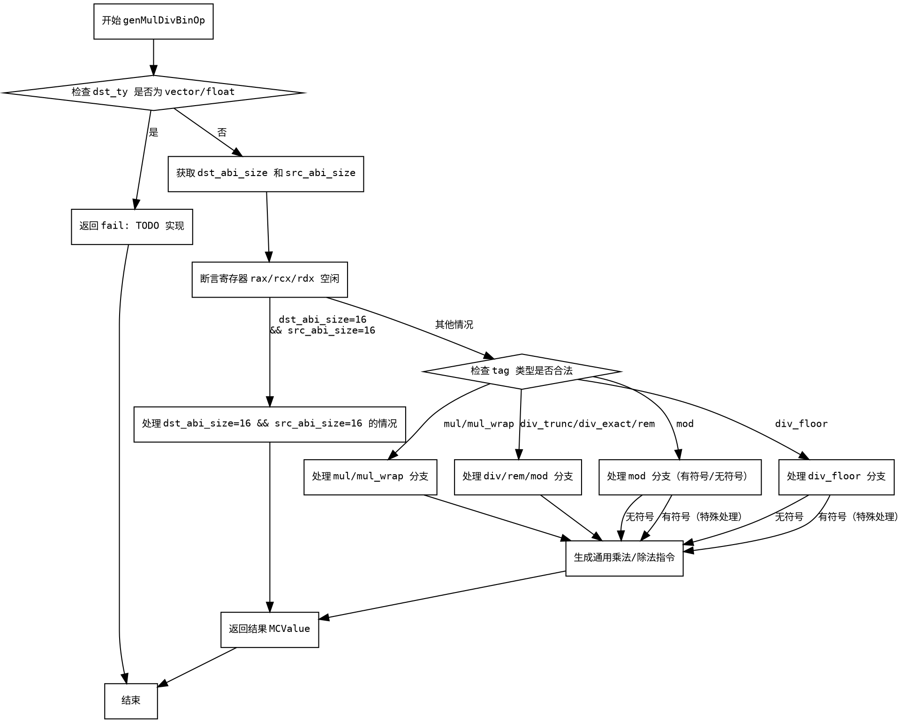

嗯，我需要为这个Zig函数生成一个Graphviz的流程图。首先，我得理解这个函数的结构和逻辑。这个函数叫genMulDivBinOp，处理乘法和除法的二进制操作。看起来有很多条件分支，比如处理不同大小的类型，不同类型的操作（如mul、div_trunc等），以及不同的符号（有符号和无符号）。

首先，我要理清函数的主要流程。函数开始检查目标类型是否是向量或浮点，如果是的话就返回失败。然后处理目标类型和源类型的ABI大小。接着有一些断言，确保某些寄存器是空闲的。接下来，根据不同的ABI大小和操作标签（tag）进行不同的处理，比如当dst_abi_size和src_abi_size都是16时的处理，或者是其他情况下的分支。

对于Graphviz流程图，我需要确定每个条件判断和对应的代码块。比如：

1. 检查dst_ty是否为向量或浮点，如果是，返回错误。
2. 处理dst_abi_size和src_abi_size的不同情况，特别是当它们都为16时。
3. 根据不同的tag（如mul、div_trunc等）进入不同的处理逻辑。
4. 对于每个操作，可能有不同的寄存器分配、汇编指令生成等步骤。

接下来，我需要将这些判断和代码块转化为流程图中的节点和边。每个条件判断对应一个菱形节点，不同的分支对应不同的处理流程。例如，第一个判断是检查dst_ty的zigTypeTag是否为向量或浮点，如果是，进入错误处理；否则继续处理ABI大小。

在处理ABI大小的时候，当两者都是16时，执行特定的汇编代码生成，否则进入其他情况。然后根据tag的不同，比如是否是mul、div_trunc等，进入不同的代码路径。每个路径中可能还有更多的条件判断，比如处理有符号和无符号的情况。

需要注意的是，函数中有多个嵌套的条件和循环（比如在处理mul时的循环），这些需要在流程图中正确表示。可能有些部分比较复杂，比如生成汇编指令的部分，但流程图应该专注于控制流的结构，而不是具体的指令生成细节。

另外，函数中有一些错误处理和TODO，这些也需要在流程图中体现，比如返回错误或调用self.fail的地方。

最后，确保所有的分支都有正确的连接，没有遗漏的条件，并且流程图的节点和边清晰可读。可能需要使用子图来组织复杂的部分，比如处理不同ABI大小或不同tag的情况。
================================================
