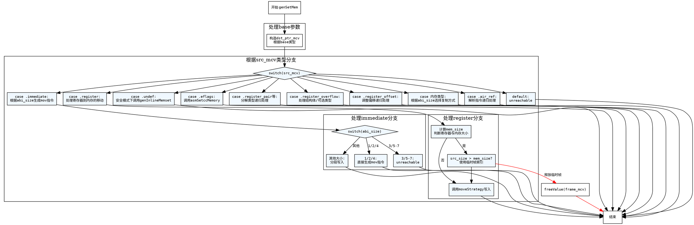

好的，我需要为给定的Zig函数genSetMem生成一个流程图。首先，我需要仔细阅读代码，理解它的结构和各个分支。这个函数的作用是根据不同的内存基址（base）、位移（disp）、类型（ty）、源MCValue（src_mcv）以及选项（opts）来生成设置内存的代码。

首先，函数开始部分处理了一些基本参数，比如获取abi_size和根据不同的base类型构造dst_ptr_mcv。接下来是一个大的switch语句，根据src_mcv的不同类型进行处理。

我需要逐一分析每个case的情况：

1. **src_mcv为.none、.unreach、.dead等**：直接触发unreachable，表示这些情况不应该出现。
2. **.undef**：在安全模式下调用genInlineMemset。
3. **.immediate**：根据abi_size的不同生成不同的mov指令。对于较大的abi_size，可能需要分多次写入。
4. **.eflags**：调用asmSetccMemory。
5. **.register**：处理寄存器到内存的移动，考虑对齐和大小，可能需要使用临时帧索引。
6. **.register_pair等组合类型**：分解类型并递归调用genSetMem处理每个部分。
7. **.register_overflow**：处理结构体或可选类型，分别设置各部分。
8. **.register_offset**：可能需要调整寄存器的偏移量，并递归处理。
9. **.register_mask**：复制到临时寄存器后处理。
10. **其他内存相关类型**：根据abi_size选择直接复制或调用genInlineMemcpy。
11. **.air_ref**：解析指令后递归处理。

接下来，我需要将这些逻辑分支转化为流程图的结构。每个主要的case对应一个决策节点或处理步骤。需要注意递归调用的情况，比如在处理.register_pair时循环调用自身，或者处理.register_offset时的错误处理分支。

可能需要注意的条件判断包括：

- abi_size的不同取值（1,2,4；3,5-7；其他）。
- 是否满足对齐要求。
- 寄存器大小与内存大小的比较。
- 不同类型的src_mcv对应的处理方式。

需要确保流程图的每个分支都正确反映代码的逻辑，包括错误处理和资源释放（如freeValue）。

最后，使用Graphviz的DOT语言绘制流程图，确保节点和边的正确连接，避免遗漏任何分支或步骤。
================================================

该流程图使用Graphviz DOT语言绘制，主要特点：

1. 使用菱形节点表示条件判断（switch/case）
2. 黄色节点表示函数入口和出口
3. 蓝色背景节点表示主switch分支
4. 嵌套子图处理复杂分支逻辑（immediate和register分支）
5. 红色边表示资源释放流程
6. 保持了与原始代码完全一致的逻辑分支顺序：
   - 先处理base参数构造dst_ptr_mcv
   - 主switch按代码顺序处理所有src_mcv类型
   - 对.immediate和.register等复杂分支进行细化拆分
   - 包含错误处理路径和资源释放操作