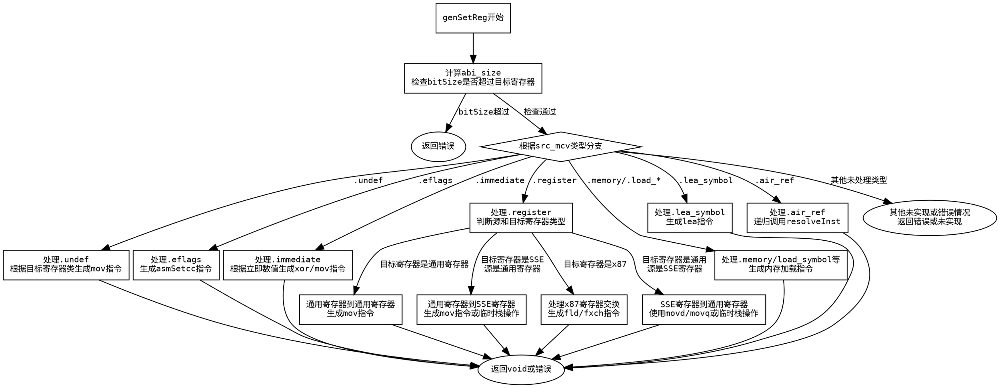

嗯，我现在需要为一个名为genSetReg的Zig函数生成一个流程图，使用Graphviz。首先，我需要理解这个函数的结构和逻辑流程。这个函数看起来是用于生成设置寄存器的代码，处理不同的MCValue（可能是指机器码值）情况。

首先，函数开始部分有一些参数检查，比如abi_size的计算，然后根据不同的src_mcv类型进行处理。每个case分支可能有不同的处理逻辑，比如立即数、寄存器、内存地址等。

接下来，我需要确定每个分支的条件和对应的操作。例如，当src_mcv是.immediate时，根据不同的abi_size生成不同的mov指令。如果src_mcv是.register，则需要处理不同寄存器类之间的移动，比如通用寄存器到SSE寄存器。

另外，还有一些错误处理，比如当遇到不支持的情况时，调用self.fail返回错误。需要注意这些错误路径也需要在流程图中体现。

由于函数内部有很多switch语句和嵌套的条件判断，我需要将这些结构转化为流程图中的节点和判断框。每个case分支对应一个判断节点，然后根据条件分支出不同的处理步骤。例如，处理.undef的情况会根据目标寄存器类生成不同的指令。

同时，函数中有递归调用的情况，比如在处理某些情况时再次调用genSetReg，这可能在流程图中形成循环或子流程。但为了简化，可能将这些递归调用表示为单独的节点，而不是展开整个递归过程。

还需要注意函数中的变量和临时寄存器的分配，比如使用allocFrameIndex分配栈帧，这些操作也需要在流程图中有所体现，但可能需要适当简化，避免过于复杂。

最后，确保所有可能的路径都被覆盖，包括错误路径和正常返回路径。每个分支结束时的操作（如生成汇编指令）应作为流程图的终端节点。

总结步骤：
1. 确定函数的主要入口和参数检查部分。
2. 分析每个src_mcv的case分支，转化为判断节点。
3. 对每个分支中的条件进一步分解，如寄存器类型、立即数大小等。
4. 处理递归调用和错误处理作为子节点或终止节点。
5. 使用Graphviz语法构建流程图，使用菱形表示判断，矩形表示操作，箭头连接流程。
================================================
