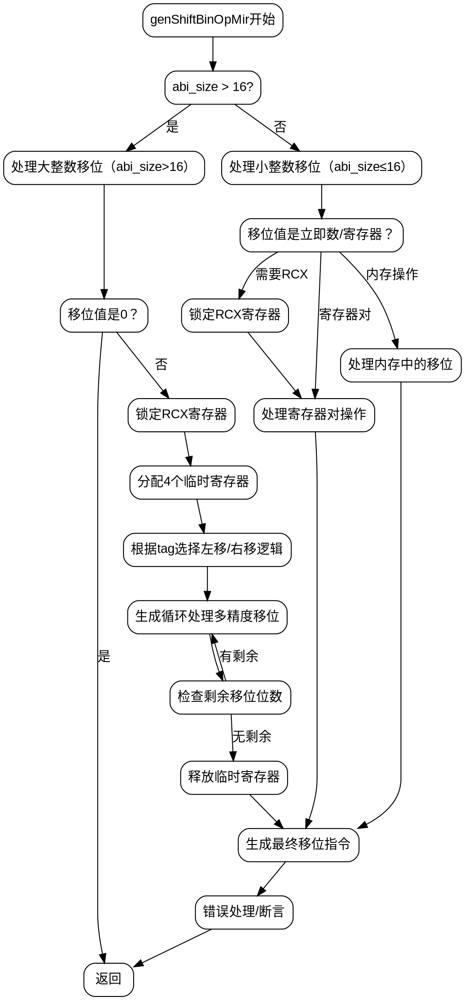

嗯，我需要为这个Zig函数genShiftBinOpMir绘制流程图。首先，我得仔细看看这个函数的结构。函数主要处理不同大小的移位操作，包括左右移位，可能涉及寄存器分配、内存操作等。

首先，函数开始部分处理abi_size大于16的情况，这里可能是在处理大整数的移位，比如超过128位的情况。然后，根据不同的移位方向（左移或右移），生成不同的汇编指令。这部分有很多条件判断，比如根据tag的值来决定是左移还是右移，还有处理立即数或寄存器作为移位值的情况。

中间部分有很多寄存器分配和锁定的代码，比如获取rcx寄存器，分配临时寄存器等。需要注意到这些寄存器操作可能会影响流程的分支。例如，当移位值是立即数时，可能会直接生成对应的汇编指令，否则需要将移位值移动到cl寄存器。

接下来，函数处理不同的移位情况，生成循环结构来处理多精度移位。例如，当移位位数超过单个寄存器的位数时，可能需要循环处理每个部分。这里有很多条件分支，比如检查是否需要进入循环，循环的终止条件等。

然后，处理abi_size大于8的情况，可能需要处理64位以上的移位，这时会涉及到寄存器对（register_pair）或者内存中的多部分操作。这部分也有不同的处理路径，取决于移位值是立即数还是寄存器，以及操作数在寄存器还是内存中。

最后，对于较小的abi_size（比如8位或更小），直接生成相应的移位指令，不需要复杂的循环处理。这里也需要处理不同的目标位置，如寄存器、内存地址等。

整个函数有很多条件分支和循环，需要将这些分支清晰地表示在流程图中。可能需要从函数入口开始，逐步画出每个条件判断的分支，如abi_size的大小，移位方向（左或右），移位值的类型（立即数或寄存器），以及操作数的位置（寄存器、内存等）。每个分支处理不同的情况，生成相应的汇编指令，并可能涉及子流程，如寄存器分配、循环处理多精度移位等。

需要注意的是，代码中有很多错误处理和断言，这些可能也需要在流程图中体现，比如当abi_size不符合预期时的错误处理。此外，函数末尾的返回语句和错误处理也需要包含在流程图中。

总之，流程图应该从函数入口开始，按照代码的逻辑顺序，逐步展开每个条件判断和处理步骤，确保每个可能的执行路径都被覆盖，并且清晰地展示函数的结构和处理流程。
================================================
