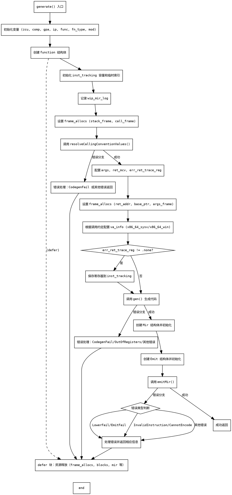

嗯，我现在需要为这个用Zig编写的generate函数绘制一个流程图。首先，我得仔细看看这个函数的结构和各个步骤。函数一开始初始化了一些变量，比如zcu、comp、gpa等，然后创建了一个function结构体，里面有很多成员。接下来有一个defer块，用于在函数退出时释放资源。然后是一些初始化操作，比如ensureTotalCapacity和循环设置temp_index。之后调用了resolveCallingConventionValues来处理调用约定，设置了一些frame_allocs的信息。再然后根据不同的调用约定（比如x86_64_sysv或x86_64_win）配置va_info。如果有错误返回跟踪寄存器，还需要处理相关逻辑。接着调用gen()生成代码，处理可能的错误。之后创建了mir和emit结构体，最后调用emitMir()来输出机器码，并处理可能的错误。

流程图应该从函数的入口开始，按照步骤分块，每个主要操作作为一个节点，条件判断和错误处理作为分支。需要注意的是defer块中的资源释放是在函数退出时执行的，所以在流程图中应该放在最后。另外，错误处理部分可能有多个分支，比如CodegenFail、OutOfRegisters等，需要分别表示。生成Mir和Emit结构体，以及emitMir的调用也是关键步骤。需要确保每个步骤之间的顺序正确，并且错误路径清晰。

可能需要注意的地方是函数中的多个错误处理，比如使用switch处理不同的错误类型，还有defer语句中的资源释放应该在所有操作之后执行。另外，函数中有多个条件分支，比如根据fn_info.cc设置va_info，以及处理err_ret_trace_reg是否存在的情况，这些都需要在流程图中体现出来。

现在需要把这些步骤转化为Graphviz的dot格式。每个主要的代码块作为一个节点，条件判断作为菱形节点，错误处理作为不同的分支。需要确保流程正确，特别是错误如何导致函数提前返回。例如，当调用resolveCallingConventionValues时，如果出现错误，除了CodegenFail外，其他错误会直接返回。同样，gen()函数调用后的错误处理也需要分支。最后，emitMir的错误处理也有不同的情况，比如LowerFail或InvalidInstruction，这些都需要不同的处理路径。

在绘制时，可能会将初始化、结构体设置、调用解析、生成代码、emit处理等作为主要步骤。错误处理路径应指向函数返回的相应错误。同时，defer的清理操作应该在所有正常和错误路径之后执行，所以可能在流程图的末尾有一个清理节点，无论之前路径如何都会执行。
================================================
