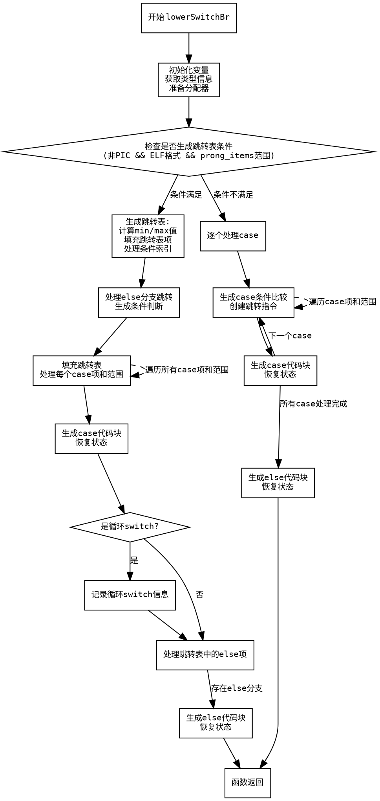

嗯，我需要为这个Zig函数`lowerSwitchBr`绘制一个流程图。首先，我得理解这个函数的结构和逻辑流程。这个函数处理switch分支的代码生成，看起来相当复杂，有很多条件判断和不同的处理路径。

首先，函数开始时会获取一些类型信息和条件值。然后，它尝试生成一个跳转表（table）来处理switch的情况，特别是当满足某些条件时（比如非PIC模式、ELF格式等）。如果生成跳转表失败，就会转到一个默认的处理流程，逐个处理每个case。

在生成跳转表的部分，函数计算最小值和最大值，确定跳转表的大小，然后填充表中的每个条目对应的代码位置。如果switch中有else分支，还需要处理相关的跳转和重定位（relocation）。

如果无法生成跳转表，函数会逐个处理每个case，生成比较和条件跳转指令，处理每个case的body，并在最后处理else分支。

我需要将这些步骤分解成流程图中的各个节点。可能的节点包括：初始化变量、检查是否生成跳转表、处理跳转表生成、处理每个case、处理else分支等。每个判断条件（如是否满足生成跳转表的条件）会导致不同的分支路径。

需要注意的是，流程图中需要区分不同的条件分支，比如是否进入跳转表生成部分，是否有else分支，以及循环处理每个case的情况。此外，错误处理和资源释放（如释放分配的内存）也需要在流程图中体现。

在绘制时，使用Graphviz的DOT语言，每个处理步骤用矩形节点表示，判断条件用菱形节点，箭头表示流程走向。需要确保所有可能的路径都被覆盖，尤其是条件分支中的break和continue部分。

可能遇到的难点是正确表示嵌套的条件判断和循环结构，比如处理cases的循环迭代，以及跳转表填充时的循环。此外，需要正确处理函数中的错误处理流程，例如try表达式的潜在错误路径。

总结步骤：
1. 开始函数，初始化变量和类型信息。
2. 检查是否满足生成跳转表的条件。
3. 如果满足，生成跳转表并处理每个case。
4. 如果不满足，逐个处理每个case，生成条件跳转。
5. 处理else分支。
6. 恢复状态，处理资源释放。
================================================
