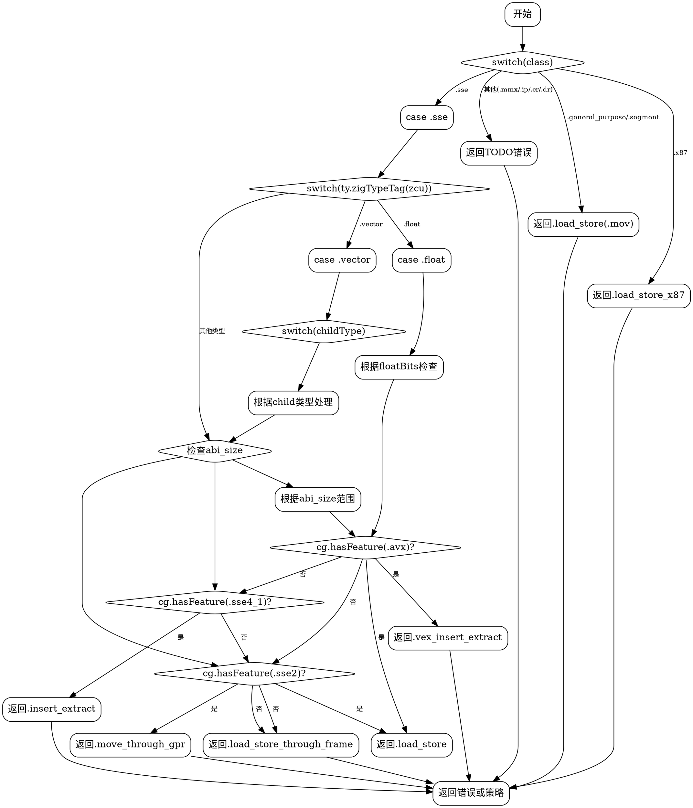

好的，我需要为提供的Zig函数`moveStrategy`绘制一个流程图。首先，我需要理解这个函数的结构和逻辑流程。

函数`moveStrategy`接受四个参数：`cg`、`ty`、`class`和`aligned`。它根据不同的`class`和类型`ty`的特征，返回不同的`MoveStrategy`。主要逻辑是通过多个switch语句处理不同的情况。

首先，函数检查`class`的值。对于`.general_purpose`和`.segment`，直接返回`.load_store`。如果是`.x87`，返回`.load_store_x87`。`.mmx`没有处理，进入下一个判断。对于`.sse`，进一步根据`ty`的类型标签（如`float`、`vector`等）进行分支处理。每个分支中可能还有更多的条件检查，比如根据`abi_size`的大小或是否支持某些CPU特性（如AVX、SSE4.1等）来决定返回的策略。

接下来，我需要将这些条件判断转化为流程图的结构。流程图的开始是函数入口，然后根据`class`的不同值分支出不同的路径。每个分支内部可能还有多层嵌套的条件判断，需要逐一展开。例如，当`class`是`.sse`时，进入`ty.zigTypeTag(zcu)`的switch，再根据不同的类型标签进一步处理，可能涉及更多的条件检查，如`abi_size`的范围或CPU特性的支持情况。

需要注意的是，某些情况下可能没有覆盖到所有路径，比如`.mmx`、`.ip`、`.cr`、`.dr`等分支没有具体处理，最后会返回一个错误。这些情况也需要在流程图中体现。

在绘制流程图时，使用Graphviz的语法，节点表示判断或操作，边表示流程的方向。每个switch语句对应一个菱形判断节点，其分支连接到相应的处理节点。处理节点可能包含返回语句或进一步的判断。

需要确保每个条件分支都被正确表示，特别是嵌套的switch和if-else结构。例如，在`.sse`分支下，处理`float`类型时，根据不同的浮点数位数和CPU特性，选择不同的返回策略。这部分需要分解成多个层级的判断节点。

另外，要注意代码中的一些细节，比如`cg.hasFeature(.avx)`这样的条件判断，这些会影响路径的选择。每个条件判断都需要在流程图中有一个对应的分支。

最后，流程图的结束点可能是返回某个策略或抛出错误。需要确保所有可能的出口都被正确连接。

总结步骤：
1. 确定函数的主要分支结构。
2. 将每个switch和if-else结构转化为流程图中的判断节点和处理节点。
3. 处理嵌套的条件结构，确保层级正确。
4. 标注每个节点的判断条件或操作内容。
5. 连接所有可能的路径，包括错误处理。

现在，根据上述分析，使用Graphviz语法绘制流程图。
================================================
